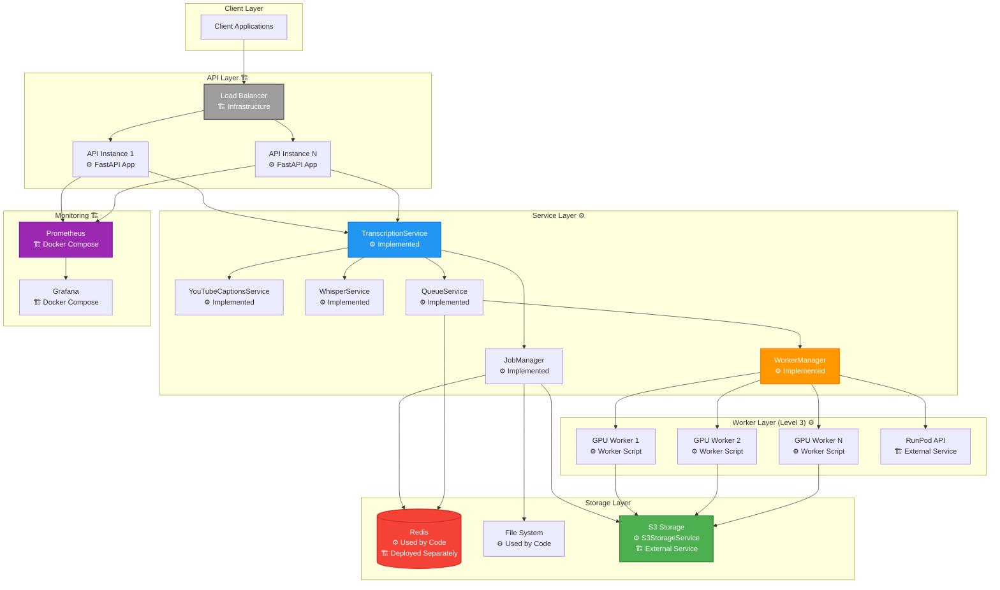
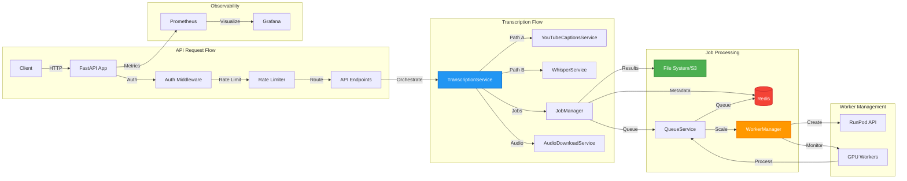
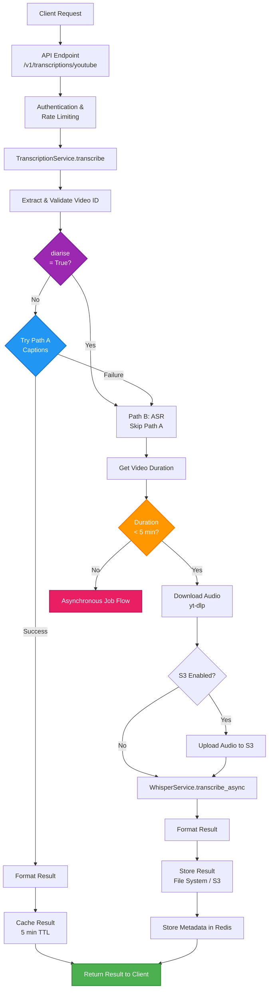
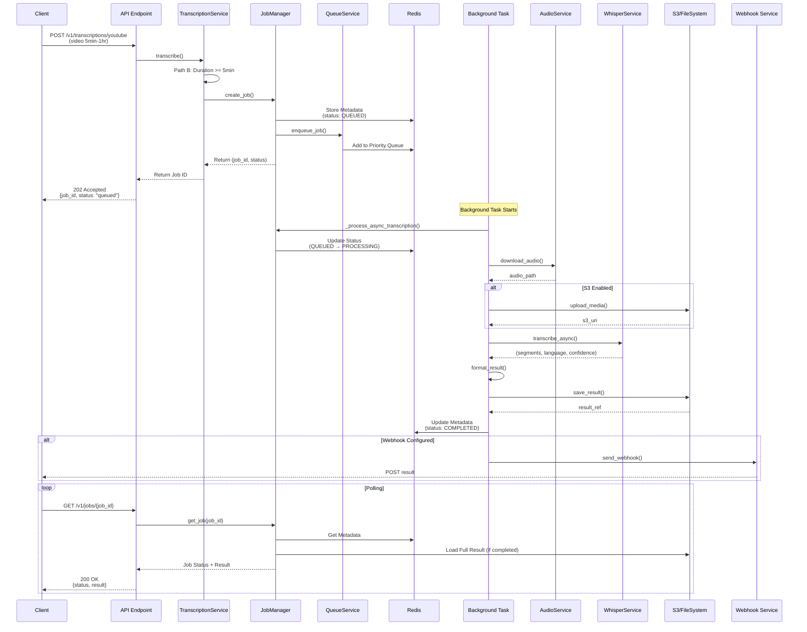
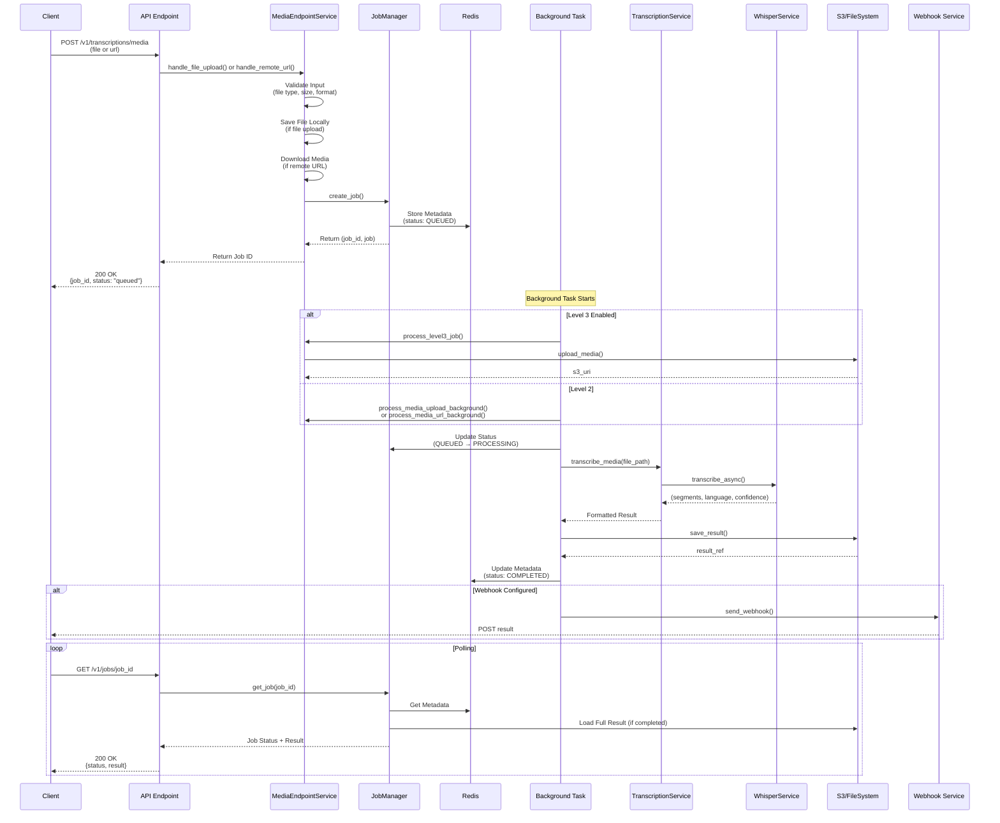
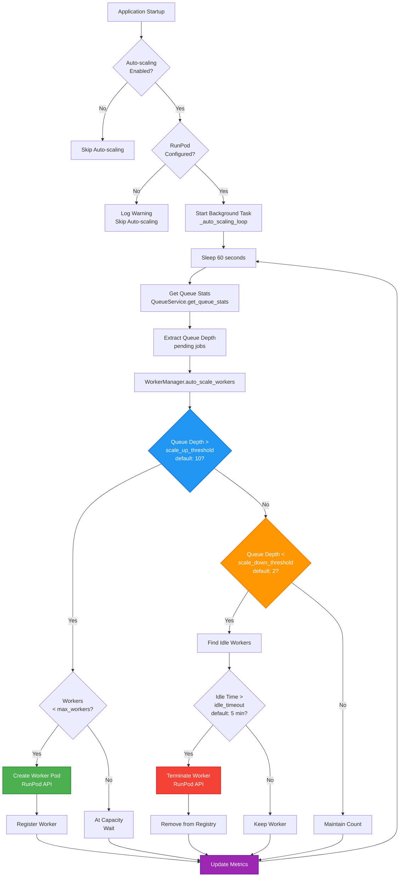

# Architecture Documentation

Detailed architecture description based on current implementation.

> **Implementation Status**: This documentation describes both:
>
> - **Code Implementation** (⚙️): Services, classes, and logic implemented in the codebase
> - **Deployment Architecture** (🏗️): Infrastructure components configured via Docker Compose, Kubernetes, or cloud services
>
> All service classes, business logic, and core functionality are implemented in code. Infrastructure components (load balancers, multiple instances, monitoring) are deployment concerns that can be configured based on your environment.

## Table of Contents

- [System Overview](#system-overview)
- [Architecture Levels](#architecture-levels)
- [Component Architecture](#component-architecture)
- [Data Flow](#data-flow)
- [Service Layer](#service-layer)
- [Storage Architecture](#storage-architecture)
- [Deployment Architecture](#deployment-architecture)
- [Security Architecture](#security-architecture)
- [Observability Architecture](#observability-architecture)

## System Overview

The YouTube Transcription API is a microservices-oriented FastAPI application designed for scalability, reliability, and performance.

### System Architecture Diagram

> **Note**: This diagram shows the logical architecture. Components marked with ⚙️ are implemented in code, while components marked with 🏗️ are deployment/infrastructure concerns (configured via Docker Compose, Kubernetes, or cloud infrastructure).



**Implementation Status**:

- **⚙️ Implemented in Code**: All service classes, managers, and core functionality are implemented in the codebase
- **🏗️ Infrastructure/Deployment**: Load balancer, multiple API instances, Prometheus, and Grafana are deployment concerns:
  - **Load Balancer**: Configured at infrastructure level (nginx, cloud load balancer, Kubernetes Ingress)
  - **Multiple API Instances**: FastAPI app is stateless and can be scaled horizontally (configured via Docker Compose replicas or Kubernetes deployments)
  - **Prometheus/Grafana**: Included in `docker-compose.yml` for local development, deployed separately in production
  - **RunPod API**: External service used by WorkerManager for GPU pod management
  - **S3**: External service (AWS S3, Cloudflare R2, MinIO) used by S3StorageService

### Core Principles

1. **Two-Path Strategy**: Fast-path (captions) with ASR fallback
2. **Async Processing**: Background jobs for long videos
3. **Horizontal Scaling**: Stateless API instances, distributed workers
4. **Observability First**: Metrics, logging, tracing
5. **Cost Control**: Budget limits, auto-scaling, resource optimization

### Technology Stack

- **Framework**: FastAPI (Python 3.11+)
- **ASR Model**: OpenAI Whisper (via Hugging Face Transformers)
- **Job Queue**: Redis Queue (implemented), AWS SQS (planned, not yet implemented)
- **Storage**: Redis (job metadata), File System/S3 (full results)
- **Workers**: RunPod GPU pods (Level 3)
- **Monitoring**: Prometheus, Grafana
- **Containerization**: Docker, Docker Compose, Kubernetes

## Architecture Levels

The system is designed with three progressive levels of functionality:

### Level 1: Basic Transcription

**Components**:

- FastAPI application
- YouTube captions extraction (Path A)
- Synchronous ASR processing for short videos (< 5 minutes)
- Redis for job metadata (with in-memory fallback if Redis unavailable)
- File system for result storage

**Use Case**: Development, low-volume production

**Dependencies**: Python, Redis (recommended, falls back to in-memory if unavailable)

### Level 2: Advanced Features

**Components**:

- All Level 1 features
- ASR fallback (Whisper)
- Media file uploads
- Speaker diarization
- Webhook callbacks
- Redis job persistence

**Use Case**: Production with moderate volume

**Dependencies**: Level 1 + GPU (optional), Redis (required)

### Level 3: Production Scale

**Components**:

- All Level 2 features
- GPU worker auto-scaling
- S3 storage
- Cost control
- Advanced observability
- Kubernetes deployment

**Use Case**: High-volume production

**Dependencies**: Level 2 + RunPod, S3, Kubernetes (optional)

## Component Architecture

### Application Structure

```
app/
├── api/                    # API layer
│   └── v1/
│       ├── endpoints/      # Route handlers
│       └── router.py       # Route aggregation
├── core/                   # Core functionality
│   ├── auth.py            # Authentication & rate limiting
│   ├── config.py          # Configuration management
│   ├── error_handlers.py  # Global error handling
│   ├── middleware.py      # Request/response middleware
│   └── startup.py         # Application lifecycle
├── models/               # Data models
│   ├── schemas.py         # Pydantic schemas
│   └── types.py           # Type definitions
├── services/              # Business logic
│   ├── jobs/              # Job management
│   ├── media/             # Media handling
│   ├── transcription/     # Transcription services
│   └── infrastructure/    # Infrastructure services
└── utils/                 # Utility functions
```

### API Layer

**Responsibilities**:

- Request validation
- Authentication/authorization
- Rate limiting
- Response formatting
- Error handling

**Components**:

- **Endpoints**: Route handlers for each endpoint
- **Router**: Aggregates all routes
- **Dependencies**: FastAPI dependency injection for auth, rate limiting

### Service Layer

**Responsibilities**:

- Business logic
- External service integration
- Data transformation
- Error handling

**Services**:

1. **TranscriptionService**: Main orchestration service implementing two-path strategy

   - Path A: YouTube captions (fast-path, no GPU)
   - Path B: Whisper ASR (fallback, requires GPU for long videos)
   - Handles sync/async decision based on video duration
   - Manages result formatting and caching

2. **YouTubeCaptionsService**: Path A implementation

   - Fetches existing YouTube captions/transcripts
   - Supports translation via YouTube API
   - No GPU required, very fast

3. **WhisperService**: Path B implementation

   - ASR transcription using OpenAI Whisper model
   - Supports multiple model sizes (base, small, medium, large-v3)
   - Async transcription in thread pool to avoid blocking event loop
   - Confidence score calculation

4. **JobManager**: Job lifecycle management

   - Creates, updates, and retrieves jobs
   - Dual storage: Redis (metadata) + File System/S3 (full results)
   - Job recovery on application restart
   - Webhook callback management

5. **QueueService**: Distributed job queue (Level 3)

   - Priority-based job queue using Redis Sorted Sets
   - Job prioritization (low, normal, high)
   - Dead letter queue for failed jobs
   - Queue statistics and monitoring
   - Currently supports Redis backend only (SQS planned)

6. **WorkerManager**: GPU worker management (Level 3)

   - Worker registration and health monitoring
   - RunPod API integration for pod lifecycle
   - Auto-scaling based on queue depth
   - Worker heartbeat tracking

7. **MediaEndpointService**: Media file upload handling

   - File validation (size, format)
   - Temporary storage management
   - Integration with transcription pipeline

8. **S3StorageService**: S3-compatible storage operations (Level 3)
   - Multipart uploads for large files
   - Media and result file storage
   - Supports AWS S3, Cloudflare R2, MinIO, etc.

### Data Layer

**Responsibilities**:

- Data persistence
- Caching
- Storage operations

**Components**:

- **Redis**: Job metadata, caching, job queue
- **File System**: Full results storage (Level 1-2)
- **S3**: Scalable storage (Level 3)

### Component Interaction Diagram



## Data Flow

### Synchronous Transcription Flow

**Note**: This flow applies to YouTube transcription endpoint (`/v1/transcriptions/youtube`). The media endpoint (`/v1/transcriptions/media`) always uses Path B (ASR) directly, as there are no captions available for uploaded media files.



**Text Flow**:

```
Client Request (YouTube)
    ↓
API Endpoint (/v1/transcriptions/youtube)
    ↓
Authentication & Rate Limiting
    ↓
TranscriptionService.transcribe()
    ↓
Extract & Validate Video ID
    ↓
Check diarise parameter
    ├─ diarise=True → Skip Path A, go directly to Path B (ASR)
    └─ diarise=False → Try Path A (Captions)
        ├─ Success → Format Result → Return (cached for 5 min)
        └─ Failure → Path B (ASR)
            ↓
    Path B: ASR Processing
        ↓
    Get Video Duration
        ↓
    Duration < 5 min?
        ├─ Yes → Synchronous ASR
        │   ↓
        │   Download Audio (yt-dlp)
        │   ↓
        │   Upload to S3 (if enabled)
        │   ↓
        │   WhisperService.transcribe_async()
        │   ↓
        │   Format Result
        │   ↓
        │   Store Result (File System / S3)
        │   ↓
        │   Store Metadata in Redis
        │   ↓
        │   Return Result
        └─ No → Asynchronous Job Flow
```

### Media Endpoint Transcription Flow

**Note**: The media endpoint (`/v1/transcriptions/media`) has a different flow from the YouTube endpoint. It always uses ASR (Path B) and processes all requests asynchronously, returning a job ID for polling.

```mermaid
flowchart TD
    A[Client Request] --> B[API Endpoint<br/>/v1/transcriptions/media]
    B --> C[Authentication &<br/>Rate Limiting]
    C --> D{Input Type?}
    D -->|File Upload| E[Validate File<br/>Size, Format]
    D -->|Remote URL| F[Validate URL<br/>Get Media Info]
    E --> G[Create Job<br/>JobManager.create_job<br/>status: QUEUED]
    F --> G
    G --> H[Store Metadata in Redis<br/>status: QUEUED]
    H --> I{Input Type?}
    I -->|File Upload| J[Save File Locally]
    I -->|Remote URL| K[Download Media File]
    J --> L{Level 3<br/>Enabled?}
    K --> L
    L -->|Yes| M[Upload to S3<br/>Enqueue Job]
    L -->|No| N[Keep File Local]
    M --> O[Update Status<br/>QUEUED → PROCESSING]
    N --> O
    O --> P[Return Job ID to Client<br/>status: PROCESSING]
    P --> Q[Background Task Starts]
    Q --> R[TranscriptionService.transcribe_media]
    R --> S[WhisperService.transcribe_async<br/>Path B: ASR Only]
    S --> T[Format Result]
    T --> U[Store Result<br/>File System / S3]
    U --> V[Update Metadata in Redis<br/>status: COMPLETED]
    V --> W[Send Webhook<br/>if configured]
    W --> X[Client Polls /v1/jobs/job_id]
    X --> Y[Return Full Result]

    style D fill:#9C27B0,stroke:#7B1FA2,stroke-width:2px,color:#fff
    style G fill:#2196F3,stroke:#1976D2,stroke-width:2px,color:#fff
    style L fill:#FF9800,stroke:#F57C00,stroke-width:2px,color:#fff
    style S fill:#FF9800,stroke:#F57C00,stroke-width:2px,color:#fff
    style P fill:#4CAF50,stroke:#388E3C,stroke-width:2px,color:#fff
    style Y fill:#4CAF50,stroke:#388E3C,stroke-width:2px,color:#fff
```



**Text Flow**:

```
Client Request (Media File/URL)
    ↓
API Endpoint (/v1/transcriptions/media)
    ↓
Authentication & Rate Limiting
    ↓
Input Validation
    ├─ File Upload: Validate file (size, format, type)
    └─ Remote URL: Validate URL, get media info
    ↓
Create Job (JobManager.create_job())
    ├─ Generate Job ID (UUID)
    ├─ Store Minimal Metadata in Redis (status: QUEUED)
    └─ Continue processing
    ↓
File Handling
    ├─ File Upload: Save file locally
    └─ Remote URL: Download media file
    ↓
Level Check
    ├─ Level 3 Enabled:
    │   ├─ Upload media to S3
    │   ├─ Enqueue job in queue service
    │   └─ Update status: QUEUED → PROCESSING
    └─ Level 2:
    │   └─ Update status: QUEUED → PROCESSING
    ↓
Return Job ID to Client (status: PROCESSING)
    ↓
Background Task (FastAPI BackgroundTasks)
    ↓
TranscriptionService.transcribe_media()
    ↓
Path B: ASR Only (no captions path available)
    ↓
WhisperService.transcribe_async()
    ├─ Extract audio from media file
    ├─ Transcribe with Whisper model
    └─ Generate segments with timestamps
    ↓
Format Result
    ├─ Convert to requested format (JSON/Text/SRT/VTT)
    └─ Include metadata (language, confidence, model)
    ↓
Store Result
    ├─ Save full result (File System / S3)
    └─ Update metadata in Redis (status: COMPLETED)
    ↓
Send Webhook Callback (if configured)
    ↓
Client Polls /v1/jobs/{job_id}
    ↓
Return Full Result (if completed)
```

**Key Differences from YouTube Endpoint**:

1. **Always Asynchronous**: Media endpoint always returns a job ID, never synchronous results
2. **No Path A**: Media files have no captions, so always uses Path B (ASR)
3. **Input Handling**: Supports both file upload and remote URL (not YouTube URLs)
4. **No Duration Check**: All media files processed asynchronously regardless of size
5. **File Validation**: Validates file type, size, and format before processing

### Asynchronous Job Flow (YouTube Endpoint)

This flow applies to YouTube videos that require async processing (5 minutes - 1 hour duration).



### Asynchronous Job Flow (Media Endpoint)

This flow applies to all media endpoint requests (file upload or remote URL). All media transcription is asynchronous.



**Text Flow (YouTube Endpoint)**:

```
Client Request (video 5 min - 1 hour)
    ↓
API Endpoint (/v1/transcriptions/youtube)
    ↓
TranscriptionService.transcribe()
    ↓
Path B (ASR) - Duration >= 5 minutes
    ↓
Create Job (JobManager.create_job())
    ├─ Generate Job ID (UUID)
    ├─ Store Minimal Metadata in Redis (with TTL)
    └─ Enqueue Job (QueueService.enqueue_job())
    ↓
Return Job ID to Client
    ↓
Background Task (FastAPI BackgroundTasks)
    ↓
JobManager._process_async_transcription()
    ├─ Update Status: QUEUED → PROCESSING
    ├─ Download Audio (yt-dlp)
    ├─ Upload Audio to S3 (if enabled)
    ├─ Transcribe with Whisper (async, thread pool)
    ├─ Format Result
    ├─ Save Full Result (File System / S3)
    ├─ Update Metadata in Redis
    ├─ Update Status: PROCESSING → COMPLETED
    └─ Send Webhook Callback (if configured)
    ↓
Client Polls /v1/jobs/{job_id}
    ↓
Return Full Result (if completed)
```

**Text Flow (Media Endpoint)**:

```
Client Request (file upload or remote URL)
    ↓
API Endpoint (/v1/transcriptions/media)
    ↓
MediaEndpointService (handles file/URL)
    ├─ Validate Input (file type, size, format)
    ├─ Save File Locally (if file upload)
    └─ Download Media (if remote URL)
    ↓
Create Job (JobManager.create_job())
    ├─ Generate Job ID (UUID)
    ├─ Store Minimal Metadata in Redis (status: QUEUED)
    └─ Return Job ID to Client Immediately
    ↓
Background Task (FastAPI BackgroundTasks)
    ↓
Media Processing
    ├─ If Level 3: Upload media to S3 (if enabled)
    └─ Process locally or via queue
    ↓
TranscriptionService.transcribe_media()
    ├─ Update Status: QUEUED → PROCESSING
    ├─ Extract audio from media file
    ├─ Transcribe with Whisper (async, thread pool)
    ├─ Format Result
    ├─ Save Full Result (File System / S3)
    ├─ Update Metadata in Redis
    ├─ Update Status: PROCESSING → COMPLETED
    └─ Send Webhook Callback (if configured)
    ↓
Client Polls /v1/jobs/{job_id}
    ↓
Return Full Result (if completed)
```

### Worker Auto-scaling Flow



**Text Flow**:

```
Application Startup
    ↓
start_auto_scaling_task() (if enabled & RunPod configured)
    ↓
Background Task: _auto_scaling_loop()
    ↓
Every 60 seconds (configurable):
    ├─ Get Queue Stats (QueueService.get_queue_stats())
    ├─ Extract Queue Depth (pending jobs)
    └─ Call WorkerManager.auto_scale_workers(queue_depth)
        ↓
    Auto-scaling Logic:
        ├─ Queue Depth > scale_up_threshold (default: 10)?
        │   ├─ Yes → Check if workers < max_workers
        │   │   ├─ Yes → Create Worker Pod (RunPod API)
        │   │   └─ No → Wait (at capacity)
        │   └─ No → Check Scale Down
        │       ↓
        └─ Queue Depth < scale_down_threshold (default: 2)?
            ├─ Yes → Find Idle Workers
            │   ├─ Check Idle Time > idle_timeout (default: 5 min)?
            │   ├─ Yes → Terminate Worker (RunPod API)
            │   └─ No → Keep Worker
            └─ No → Wait (maintain current count)
    ↓
Update Worker Metrics (Prometheus)
    ↓
Continue Loop
```

## Service Layer

### TranscriptionService

**Purpose**: Main orchestration service implementing two-path transcription strategy

**Key Methods**:

- `transcribe()`: Main entry point, implements two-path decision logic
  - If `diarise=True`: Skips Path A, goes directly to Path B (ASR)
  - If `diarise=False`: Attempts Path A (captions) first, falls back to Path B (ASR) if captions unavailable
  - Handles sync/async decision based on video duration
- `_try_captions_path()`: Attempts Path A with caching
- `_path_a_captions()`: Fetches YouTube captions (fast-path)
- `_path_b_asr()`: Executes ASR path with duration check
- `_asr_sync()`: Synchronous ASR for short videos (< 5 min)
- `_asr_async()`: Creates async job for medium videos (5 min - 1 hour)
- `transcribe_media()`: Transcribes uploaded media files (always ASR)

**Decision Logic**:

**YouTube Endpoint** (`transcribe()`):

- Path A (Captions): Attempted first only if `diarise=False`
- Path B (ASR): Triggered if:
  - `diarise=True` (skips Path A, goes directly to Path B)
  - Captions unavailable/disabled
  - Translation requested but captions can't satisfy
- Sync vs Async: Based on video duration
  - < 5 minutes: Synchronous (returns immediately)
  - 5 minutes - 1 hour: Asynchronous (returns job ID)
  - > 1 hour: Rejected with `VIDEO_TOO_LONG` error

**Media Endpoint** (`transcribe_media()`):

- Always uses Path B (ASR) - no captions path available
- All media files (uploaded or remote URL) go through Whisper ASR
- Processing is always asynchronous (returns job ID for polling)

**Caching**:

- Captions results cached in-memory (TTLCache, 5 min TTL)
- Video ID extraction cached (1 hour TTL)
- Cache key includes: video_id, translate_to, format

**Dependencies**:

- YouTubeCaptionsService (Path A)
- AudioDownloadService (Path B)
- WhisperService (Path B)
- JobManager (async jobs)

### JobManager

**Purpose**: Job lifecycle management with dual storage strategy

**Key Methods**:

- `create_job()`: Creates new job, stores metadata in Redis
- `get_job()`: Retrieves job metadata, optionally loads full result
- `update_job_status()`: Updates job status (QUEUED → PROCESSING → COMPLETED/FAILED)
- `complete_job()`: Marks job as completed, saves full result, updates metadata
- `fail_job()`: Marks job as failed with error message
- `get_all_jobs()`: Lists all jobs (cached for performance)
- `recover_orphaned_jobs()`: Recovers jobs stuck in PROCESSING state on restart
- `store_sync_result_metadata()`: Stores metadata for synchronous ASR results

**Storage Strategy**:

- **Redis**: Minimal job metadata (status, timestamps, references)
  - Fast lookups and status updates
  - TTL-based expiration (default: 1 hour)
  - Fallback to in-memory if Redis unavailable
- **File System / S3**: Full transcription results
  - Complete result JSON with all segments and metadata
  - Referenced by `resultRef` in Redis metadata
  - Date-based directory structure for organization

**Job States**: QUEUED → PROCESSING → COMPLETED | FAILED

### WorkerManager

**Purpose**: GPU worker management and auto-scaling (Level 3)

**Key Methods**:

- `register_worker()`: Registers new worker when it starts up
- `heartbeat()`: Updates worker heartbeat and status
- `assign_job()`: Assigns a job to a worker
- `complete_job()`: Marks job as completed and updates worker stats
- `get_available_workers()`: Returns list of idle workers ready for jobs
- `get_all_workers()`: Lists all registered workers
- `health_check_workers()`: Checks worker health based on heartbeat timeout
- `scale_workers()`: Scales to target worker count
- `auto_scale_workers()`: Auto-scales based on queue depth
- `_create_worker()`: Creates new RunPod pod via GraphQL API
- `_terminate_worker()`: Terminates RunPod pod

**Worker States**:

- `WARMING_UP`: Worker starting, loading model
- `IDLE`: Ready to accept jobs
- `BUSY`: Processing a job
- `UNHEALTHY`: No heartbeat received within timeout

**Integration**:

- RunPod GraphQL API for pod lifecycle management
- Background auto-scaling task (started at application startup)
- Health monitoring via heartbeat mechanism

### QueueService

**Purpose**: Distributed job queue operations (Level 3)

**Key Methods**:

- `enqueue_job()`: Adds job to queue with priority
- `dequeue_job()`: Retrieves highest priority job for worker
- `get_queue_stats()`: Returns pending, processing, and failed job counts
- `requeue_failed_job()`: Retries failed jobs or moves to dead letter queue
- `get_job_position()`: Gets job position in queue

**Implementation**:

- Uses Redis Sorted Sets (ZADD/ZPOPMIN) for priority queue
- Job data stored in Redis hashes with TTL
- Processing queue tracks jobs currently being processed
- Dead letter queue for jobs exceeding max retries

**Backends**:

- Redis Queue (implemented, default)
- AWS SQS (planned, not yet implemented - raises error if selected)

## Storage Architecture

### Redis Storage

**Purpose**: Fast metadata storage for job tracking and caching

**Data Model**:

```
job:{job_id} → {
    "job_id": "uuid",
    "status": "queued|processing|completed|failed",
    "created_at": "ISO 8601",
    "completed_at": "ISO 8601 (if completed/failed)",
    "video_id": "string",
    "video_url": "string",
    "translate_to": "string|null",
    "format": "json|text|srt|vtt",
    "diarise": "boolean",
    "resultRef": "relative path or S3 URI",
    "progress": "float|null (0.0-1.0)",
    "language": "string|null (ISO 639-1)",
    "model": "string|null (e.g., whisper-base)",
    "duration": "float|null (seconds)",
    "source": "youtube_captions|asr|null",
    "error": "string|null (if failed)",
    "webhook_url": "string|null"
}
```

**Operations**:

- SET/SETEX: Store job metadata with TTL (default: 1 hour)
- GET: Retrieve job metadata
- SCAN: List all jobs (cursor-based, non-blocking)
- Connection pooling for performance

**Fallback**: If Redis is unavailable, falls back to in-memory storage (jobs lost on restart)

### File System Storage

**Purpose**: Full result storage (used when S3 is disabled)

**Structure**:

```
{temp_store_dir}/  (default: ./results)
  YYYY-MM-DD/
    {job_id}.json
```

**Content**: Complete transcription result with all metadata:

- Full transcript text
- Segments with timestamps
- Language, confidence, model info
- Video metadata
- Format-specific data

**Storage Strategy**:

- Dual storage: Redis stores minimal metadata, file system stores full results
- Results are stored even for synchronous ASR (for consistency)
- Date-based directory structure for easy cleanup
- Results referenced by `resultRef` in Redis metadata

**Cleanup**: Manual or scheduled cleanup based on TTL (default: 1 hour)

### S3 Storage (Level 3)

**Purpose**: Scalable, persistent storage for production deployments

**Structure**:

```
s3://{bucket_name}/
  media/                    (s3_media_prefix, default: "media/")
    YYYY-MM-DD/
      {job_id}.{ext}       (audio/video files)
  results/                 (s3_results_prefix, default: "results/")
    YYYY-MM-DD/
      {job_id}.json        (full transcription results)
```

**Features**:

- **Multipart uploads**: Automatic for files > 100MB (configurable)
- **S3-compatible**: Supports AWS S3, Cloudflare R2, MinIO, etc.
- **Content type detection**: Automatic MIME type assignment
- **Backward compatibility**: Handles old path formats for migration
- **Lifecycle policies**: Can be configured at bucket level for automatic cleanup

**Usage**:

- Media files uploaded during async job processing
- Results stored after transcription completion
- `resultRef` in Redis points to S3 URI (e.g., `s3://bucket/results/2024-01-15/job-id.json`)
- Falls back to file system if S3 upload fails (with warning)

## Application Lifecycle

### Startup Sequence

The application follows a structured startup sequence defined in `app/core/startup.py`:

1. **Configuration Validation**: Validates production settings (API keys, CORS)
2. **Dev Mode Warnings**: Logs warnings for insecure development configurations
3. **Job Recovery**: Recovers orphaned jobs from previous run (marks as failed)
4. **Model Preloading**: Pre-loads Whisper model to reduce first-request latency
5. **Observability Initialization**: Registers Prometheus metrics
6. **Auto-scaling Task**: Starts background task for worker auto-scaling (if enabled)

### Shutdown Sequence

1. **Auto-scaling Task Cancellation**: Gracefully cancels background auto-scaling loop
2. **Resource Cleanup**: Closes HTTP clients, connection pools
3. **Logging**: Final shutdown messages

### Background Tasks

**Auto-scaling Loop** (`_auto_scaling_loop`):

- Runs continuously in background (started at application startup)
- Checks queue depth every 60 seconds (configurable)
- Calls `WorkerManager.auto_scale_workers()` to adjust worker count
- Handles errors gracefully without stopping the loop
- Cancelled gracefully during shutdown

**Job Processing**:

- FastAPI BackgroundTasks for async job processing
- Each job processed in separate background task
- Errors handled with job failure marking

## Deployment Architecture

### Docker Compose Deployment

**Services**:

- `transcription-api`: Main API service
- `redis`: Job storage
- `minio`: S3-compatible storage (local)
- `prometheus`: Metrics collection
- `grafana`: Metrics visualization

**Networking**: Bridge network for service communication

**Volumes**: Model storage, results, logs

### Kubernetes Deployment

**Components**:

- **Deployment**: API pods (stateless, scalable)
- **StatefulSet**: Redis (if not external)
- **Service**: Load balancer for API
- **ConfigMap**: Configuration
- **Secret**: API keys, passwords
- **HPA**: Horizontal Pod Autoscaler

**See**: `infrastructure/kubernetes/` for manifests

### Worker Deployment

**RunPod Pods**:

- GPU-enabled containers
- Worker script connects to API
- Auto-scaling via RunPod API
- Health monitoring via heartbeats

## Security Architecture

### Authentication

**Method**: Bearer token (API key)

**Flow**:

1. Client sends `Authorization: Bearer {API_KEY}`
2. API validates key against configured keys
3. Rate limiting per API key

**Storage**: Environment variables (`.env`)

### Rate Limiting

**Implementation**: `slowapi` middleware

**Strategy**: Per-API-key rate limiting

**Default**: 60 requests/minute (configurable)

### CORS

**Configuration**: Environment variable

**Production**: Specific origins only

**Development**: `*` allowed (with warnings)

### Input Validation

**Pydantic Models**: Request/response validation

**URL Validation**: Regex patterns, length limits

**File Validation**: Size limits, format validation

## Observability Architecture

### Metrics

**Prometheus Metrics**:

- Request counts and durations
- Job processing metrics
- Queue depth
- Worker status
- Error rates

**Endpoint**: `/v1/metrics`

**Scraping**: Prometheus scrapes metrics endpoint

### Logging

**Format**: Structured JSON (production) or text (development)

**Levels**: DEBUG, INFO, WARNING, ERROR, CRITICAL

**Fields**: Timestamp, level, message, context

### Tracing

**Status**: Optional (OpenTelemetry)

**Configuration**: `TRACING_ENABLED`, `TRACING_ENDPOINT`

### Dashboards

**Grafana Dashboards**:

- API performance
- Job processing
- Worker status
- Error rates

**Location**: `infrastructure/grafana/dashboards/`

## Scalability Considerations

### Horizontal Scaling

**API Instances**:

- Stateless design allows horizontal scaling
- No shared state between instances
- All state in Redis (metadata) and S3/file system (results)

**Load Balancing**:

- Round-robin or least-connections
- Health check endpoint: `/health`
- Session affinity not required

**Scaling Triggers**:

- CPU/memory metrics
- Request rate
- Queue depth (for worker scaling)

### Vertical Scaling

**GPU Workers**:

- Auto-scaling based on queue depth
- Configurable thresholds (scale up/down)
- Min/max worker limits
- Idle timeout for cost optimization

**Auto-scaling Configuration**:

- `worker_scale_up_queue_depth`: Default 10 jobs
- `worker_scale_down_queue_depth`: Default 2 jobs
- `worker_idle_timeout_seconds`: Default 5 minutes
- `worker_auto_scaling_interval_seconds`: Default 60 seconds

**Resource Limits**:

- CPU, memory limits per container
- GPU allocation per worker pod
- Connection pool limits (Redis)

### Database Scaling

**Redis**:

- Connection pooling (default: 50 max connections)
- Redis Cluster for high availability (recommended for production)
- SCAN operations for non-blocking key enumeration
- TTL-based automatic cleanup

**S3**:

- Automatically scales (managed service)
- Multipart uploads for large files
- CDN integration possible
- Lifecycle policies for cost optimization

### Caching Strategy

**Captions Cache**:

- In-memory TTLCache (default: 1000 entries, 5 min TTL)
- Only caches Path A (captions) results
- Video ID extraction cache (5000 entries, 1 hour TTL)

**Job List Cache**:

- Redis-backed with in-memory cache layer
- 10 second TTL to reduce Redis load
- Invalidated on job create/update

## Next Steps

- Review [Features Documentation](features.md) for feature details
- Check [Configuration Guide](CONFIGURATION.md) for settings
- See [Docker Infrastructure](docker.md) for deployment
