# Features and Backend Logic

Detailed overview of features and their backend implementation based on the actual codebase.

## Table of Contents

- [Two-Path Transcription Strategy](#two-path-transcription-strategy)
- [Path A: YouTube Captions](#path-a-youtube-captions)
- [Path B: ASR Fallback](#path-b-asr-fallback)
- [Job Management](#job-management)
- [Worker Management](#worker-management)
- [Queue Management](#queue-management)
- [Storage Systems](#storage-systems)
- [Caching Strategy](#caching-strategy)
- [Error Handling](#error-handling)
- [Performance Optimizations](#performance-optimizations)

## Two-Path Transcription Strategy

The core feature of the API is a two-path transcription strategy that optimizes for speed and reliability. Path A uses existing YouTube captions (fast, no GPU), while Path B uses Whisper ASR (slower, requires GPU/CPU).

**Note**: This two-path strategy applies to the YouTube transcription endpoint (`/v1/transcriptions/youtube`). The media endpoint (`/v1/transcriptions/media`) always uses Path B (ASR) directly, as there are no captions available for uploaded media files or remote URLs.

### Decision Flow Diagram

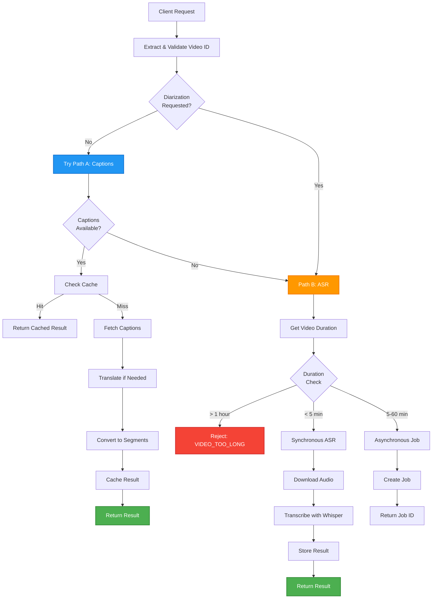

### Decision Logic

**YouTube Endpoint** (`TranscriptionService.transcribe()`):

1. **Extract and validate video ID** from YouTube URL (with caching)
2. **Check for diarization request**: If `diarise=True`, skip Path A and go directly to Path B
3. **Try Path A (Captions)**: Attempt to fetch YouTube captions with caching (only if `diarise=False`)
4. **Fallback to Path B (ASR)**: If Path A fails, use Whisper ASR

**Media Endpoint** (`TranscriptionService.transcribe_media()`):

- Always uses Path B (ASR) - no captions path available
- All media files (uploaded or remote URL) go through Whisper ASR
- Processing is always asynchronous (returns job ID for polling)

### Implementation

```python
# app/services/transcription/transcription_service.py

async def transcribe(self, video_url, translate_to=None, format=OutputFormat.JSON,
                     diarise=False, webhook_url=None):
    # Extract and validate video ID (with caching)
    video_id = self._extract_and_validate_video_id(video_url)

    # Skip Path A if diarization requested
    if not diarise:
        try:
            return await self._try_captions_path(video_url, video_id, translate_to, format)
        except (CouldNotRetrieveTranscript, TranscriptsDisabled, CaptionsNotAvailableError):
            logger.info(f"Path A failed, falling back to Path B")

    # Path B: ASR fallback
    return await self._path_b_asr(video_url, video_id, translate_to, format, diarise, webhook_url)
```

## Path A: YouTube Captions

Fast-path using existing YouTube captions when available. This path requires no GPU and typically completes in seconds.

### Service: `YouTubeCaptionsService`

**Location**: `app/services/transcription/youtube_captions.py`

### Features

1. **Video ID Extraction**: Validates and extracts video ID from various YouTube URL formats (cached)
2. **Transcript Listing**: Lists all available transcripts for a video
3. **Language Selection**: Sophisticated fallback logic for language selection
4. **Translation**: Multi-step translation workflow with variant matching
5. **Segment Conversion**: Converts raw transcript data to structured `TranscriptSegment` format
6. **Error Detection**: Detects IP blocking and other API errors

### Implementation Flow

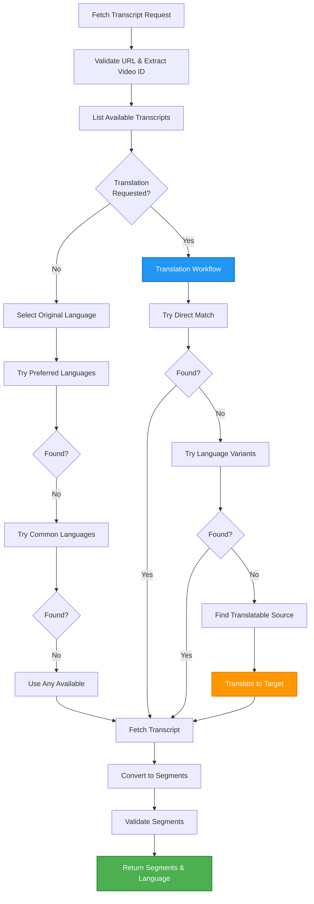

### Language Selection Logic

The service implements sophisticated language selection with multiple fallback strategies:

**For Original Language (no translation)**:

1. Try preferred languages (configurable, default: `["en", "es", "fr", "de", "it", "pt", "ru"]`)
2. If not found, try common languages (default: `["en", "es", "fr", "de", "it", "pt", "ru", "ja", "ko", "zh-Hans", "zh-Hant"]`)
3. If still not found, use any available transcript

**For Translation**:

1. **Direct Match**: Try to find transcript directly in target language
2. **Variant Matching**: Match base language (e.g., `en-GB` matches `en`)
3. **Translation**: Find best source transcript and translate to target
   - Prefers manually-created transcripts over auto-generated
   - Checks translation capabilities before attempting
   - Tries multiple source languages if first attempt fails

### Translation Workflow Details

The translation workflow is more complex than simple translation:

```python
# 1. Try direct match in target language
transcript = transcript_list.find_transcript([translate_to])

# 2. If not found, try language variants (e.g., en-GB for en)
for transcript in available_transcripts:
    if base_language(transcript.language_code) == base_language(translate_to):
        # Use variant directly (no translation needed)
        return transcript.fetch()

# 3. Find best source transcript for translation
candidate_transcripts = build_candidate_transcripts(
    transcript_list,
    preferred_languages
)

# 4. Try translation from each candidate
for source_transcript in candidate_transcripts:
    if can_translate(source_transcript, translate_to):
        translated = source_transcript.translate(translate_to)
        return translated.fetch()
```

### Caching

Path A results are cached using `TTLCache` (in-memory LRU cache):

- **Cache Key**: `{video_id}:{translate_to}:{format}`
  - Example: `"dQw4w9WgXcQ:en:json"`
- **TTL**: 5 minutes (configurable via `CACHE_TTL_SECONDS`, default: 300)
- **Max Size**: 1000 entries (configurable via `CACHE_MAX_SIZE`, default: 1000)
- **Eviction**: LRU (Least Recently Used) when cache is full
- **Monitoring**: Logs warnings when cache reaches 80% capacity

**Note**: Only Path A results are cached. ASR results are not cached due to their size and the fact that they're already stored in persistent storage.

### Error Handling

- **Video Not Found**: Raises `VideoUnavailable` → Falls back to Path B
- **Captions Disabled**: Raises `TranscriptsDisabled` → Falls back to Path B
- **IP Blocked**: Detects IP blocking via error message analysis → Falls back to Path B
- **Translation Unavailable**: If translation fails after trying all candidates → Falls back to Path B
- **No Transcripts**: Raises `CouldNotRetrieveTranscript` → Falls back to Path B

## Media Endpoint Flow

The media endpoint (`/v1/transcriptions/media`) handles uploaded media files and remote URLs. Unlike the YouTube endpoint, it has a simplified flow since there are no captions available for media files.

### Key Characteristics

1. **Always Asynchronous**: All media transcription requests return a job ID immediately
2. **Path B Only**: No captions path available, always uses Whisper ASR
3. **Dual Input Support**: Accepts both file uploads and remote URLs
4. **File Validation**: Validates file type, size, and format before processing

### Service: `MediaEndpointService`

**Location**: `app/services/media/media_endpoint_service.py`

### Features

1. **File Upload Handling**: Validates and saves uploaded media files
2. **Remote URL Handling**: Downloads and validates remote media files
3. **Input Validation**: Checks file type, size, and format
4. **Job Creation**: Creates async jobs for all media transcription
5. **Level 2/3 Support**: Handles both local storage and S3 workflows

### Processing Flow

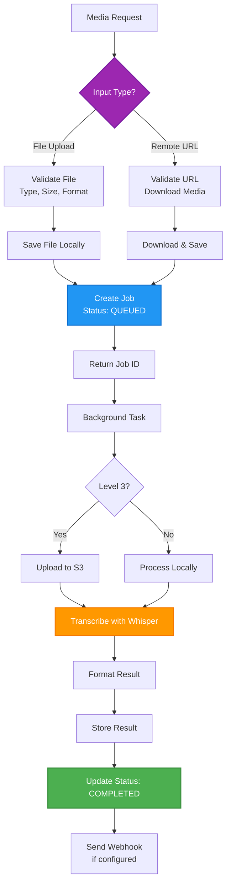

### Implementation Flow

```
1. Input Validation
   - File Upload: Check file type, size (max 500MB), format
   - Remote URL: Validate URL, check content type, get media info (no download yet for Level 2)

2. Job Creation
   - Generate unique job ID (UUID)
   - Store minimal metadata in Redis (status: QUEUED)

3. File Handling
   - File Upload: Save file to temporary storage
   - Remote URL (Level 3): Download media file, upload to S3
   - Remote URL (Level 2): Download happens in background task

4. Status Update & Response
   - Update job status: QUEUED → PROCESSING
   - If Level 3: Upload to S3, enqueue job in queue service
   - Return job ID to client (status: PROCESSING)

5. Background Processing
   - Remote URL (Level 2 only): Download media from remote URL
   - If Level 2 with S3: Upload media to S3 (optional)
   - Call TranscriptionService.transcribe_media()
   - Extract audio from media file (if video)
   - Transcribe with Whisper ASR
   - Format result according to requested format
   - Store full result (File System / S3)
   - Update metadata in Redis (status: COMPLETED)
   - Send webhook callback (if configured)

6. Client Polling
   - Client polls GET /v1/jobs/{job_id}
   - API returns job status and result (if completed)
```

### Supported Media Formats

**Audio Formats**: `mp3`, `wav`, `m4a`, `flac`, `ogg`

**Video Formats**: `mp4`, `mkv`, `avi`, `mov`, `webm`

**Maximum File Size**: 500MB (configurable)

### Differences from YouTube Endpoint

| Feature               | YouTube Endpoint      | Media Endpoint            |
| --------------------- | --------------------- | ------------------------- |
| **Input**             | YouTube URL only      | File upload or remote URL |
| **Path A (Captions)** | Available             | Not available             |
| **Path B (ASR)**      | Fallback              | Always used               |
| **Sync/Async**        | Based on duration     | Always async              |
| **Duration Check**    | Yes (< 5 min = sync)  | No (all async)            |
| **File Validation**   | URL validation only   | File type, size, format   |
| **Response**          | Sync result or job ID | Always job ID             |

## Path B: ASR Fallback

Automatic Speech Recognition using OpenAI Whisper model when captions unavailable. This path requires GPU (preferred) or CPU and processes audio files.

**Note**: Path B is used by both YouTube endpoint (as fallback) and media endpoint (always).

### Service: `WhisperService`

**Location**: `app/services/transcription/whisper_service.py`

### Features

1. **Model Loading**: Singleton pattern with thread-safe model loading
2. **Device Detection**: Automatic CPU/CUDA/MPS detection (configurable)
3. **Transcription**: Audio-to-text with timestamps
4. **Translation**: Translate to English only (Whisper limitation)
5. **Confidence Calculation**: Heuristic-based confidence scores
6. **Async Processing**: Non-blocking inference using thread pools

### Processing Mode Decision (YouTube Endpoint Only)

For YouTube endpoint, the system automatically decides between synchronous and asynchronous processing based on video duration. **Note**: Media endpoint always processes asynchronously.

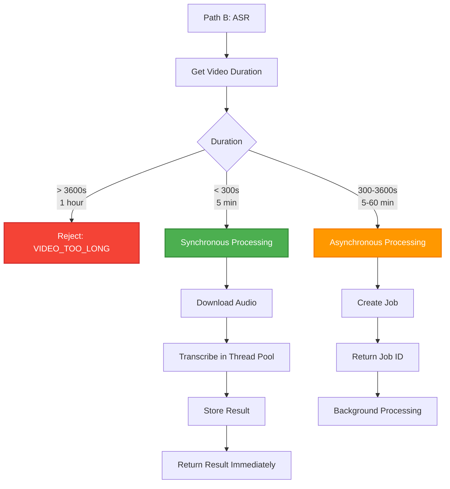

**Thresholds** (configurable):

- **Synchronous**: `< async_threshold_seconds` (default: 300s = 5 minutes)
- **Asynchronous**: `>= async_threshold_seconds` and `< max_video_duration_seconds` (default: 3600s = 1 hour)
- **Rejected**: `>= max_video_duration_seconds` (default: 3600s = 1 hour)

### Implementation Flow

```
1. Get video duration (lightweight, no download)
2. Check duration against thresholds
3. If synchronous:
   - Download audio using yt-dlp (WAV, 16kHz, mono)
   - Upload to S3 if enabled
   - Transcribe with Whisper (async, in thread pool)
   - Format result
   - Store result (S3 or file system)
   - Store metadata in Redis
   - Return result immediately
4. If asynchronous:
   - Create job in Redis
   - Enqueue job in queue
   - Return job ID
   - Process in background task
```

### Model Loading

The Whisper model uses a singleton pattern with thread-safe initialization:

```python
# Class-level singleton storage
_instance: Optional["WhisperService"] = None
_lock = threading.Lock()
_model = None  # Shared across all instances

def __new__(cls):
    """Thread-safe singleton creation."""
    if cls._instance is None:
        with cls._lock:
            if cls._instance is None:
                cls._instance = super().__new__(cls)
    return cls._instance

def ensure_model_loaded(self, force_reload=False):
    """Pre-load model at startup (thread-safe)."""
    with cls._lock:
        if not cls._is_loaded or force_reload:
            # Load model from local path or Hugging Face
            self._create_whisper_pipeline(model_source, use_local_model)
            cls._is_loaded = True
```

**Model Sources**:

- **Local Path**: If `whisper_model_path` is configured and valid, loads from local directory
- **Hugging Face**: Otherwise, downloads from Hugging Face (cached after first download)

**Device Selection**:

- **CUDA**: If `whisper_device="cuda"` and CUDA available
- **MPS**: If `whisper_device="mps"` and Apple Silicon available
- **CPU**: Default fallback

**Precision**:

- **CPU**: `float32` (better compatibility)
- **GPU (CUDA/MPS)**: `float16` (better performance, lower memory)

### Confidence Calculation

Confidence is calculated using a heuristic approach with multiple weighted factors:

```python
confidence = (
    coverage_weight * coverage_ratio +           # Default: 0.4
    density_weight * density_score +              # Default: 0.2
    text_quality_weight * text_quality_score +   # Default: 0.2
    gap_weight * gap_score                        # Default: 0.2
)
```

**Components**:

1. **Coverage Ratio** (weight: 0.4, default)

   - Percentage of audio duration covered by segments
   - Formula: `sum(segment_durations) / audio_duration`
   - Range: 0.0-1.0

2. **Segment Density Score** (weight: 0.2, default)

   - Segments per second of audio
   - Optimal range: 2-5 segments/second = 1.0
   - Below 1.0 or above 10.0 = penalty
   - Configurable thresholds: `whisper_segment_density_optimal_min/max`

3. **Text Quality Score** (weight: 0.2, default)

   - Combined from three sub-metrics:
     - **Punctuation Ratio** (weight: 0.5): Punctuation marks per word
     - **Capitalization Ratio** (weight: 0.3): Capitalized words per word
     - **Word Length Score** (weight: 0.2): Average word length (optimal: 3-6 chars)

4. **Gap Score** (weight: 0.2, default)
   - Consistency of gaps between segments
   - Small gaps (< 2s) = 1.0
   - Medium gaps (2-5s) = 0.8
   - Large gaps (5-10s) = 0.6
   - Very large gaps (> 10s) = 0.4

**Note**: If chunk-level confidence scores are available from Whisper, they take precedence over heuristic calculation.

### Translation Limitations

**Important**: Whisper ASR can only translate to English. If `translate_to` is specified and not "en", the system:

- Returns error code `TRANSLATION_NOT_SUPPORTED` for sync processing
- Falls back to Path A (captions) if available, which supports translation to any language

## Job Management

Async job processing for medium-length videos (5 minutes - 1 hour).

### Service: `JobManager`

**Location**: `app/services/jobs/job_manager.py`

### Storage Strategy

The system uses a three-tier storage strategy:

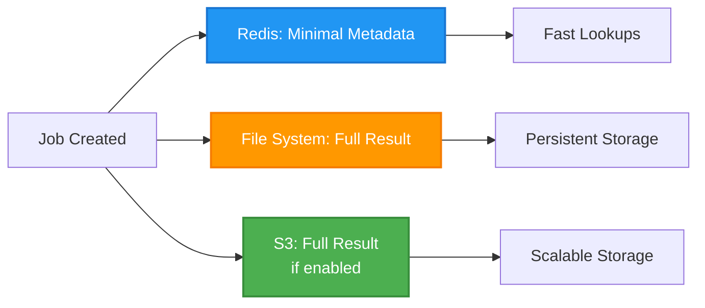

1. **Redis** (Primary): Stores minimal job metadata

   - Status, timestamps, video_id, error messages
   - Result reference (file path or S3 URI)
   - Fast lookups and updates
   - TTL: `job_ttl_seconds` (default: 3600s = 1 hour)
   - Key format: `job:{job_id}`

2. **File System** (Secondary): Stores full results

   - Path: `{temp_store_dir}/YYYY-MM-DD/{job_id}.json`
   - Organized by date for easy cleanup
   - Contains complete transcription result with all metadata
   - Default: `./results`

3. **S3 Storage** (Optional, Level 3): Scalable storage

   - Structure: `s3://{bucket}/results/YYYY-MM-DD/{job_id}.json`
   - Multipart uploads for large files
   - Automatic cleanup via lifecycle policies
   - Falls back to file system if S3 unavailable

4. **In-Memory** (Fallback): Used if Redis unavailable
   - Jobs lost on restart (not recommended for production)

### Job States

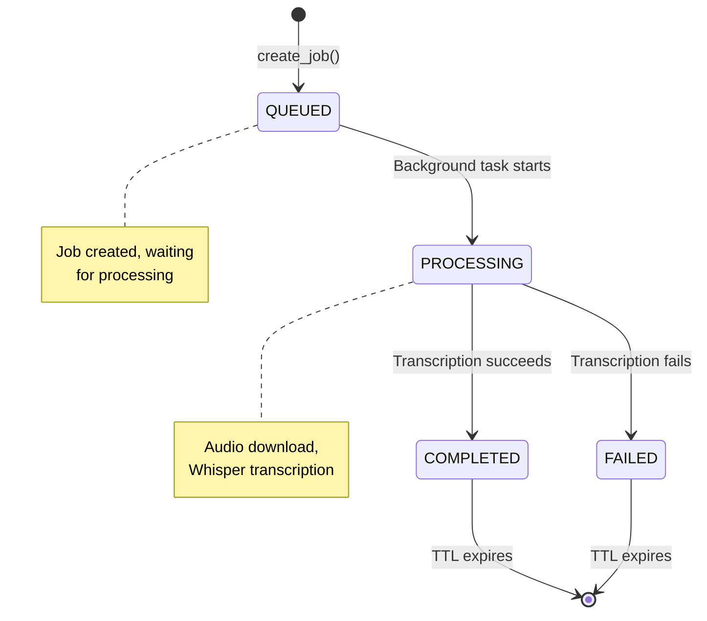

### Job Creation and Processing

```python
# 1. Create job
job_id, job = job_manager.create_job(
    video_url=video_url,
    video_id=video_id,
    translate_to=translate_to,
    format=format,
    diarise=diarise,
    webhook_url=webhook_url
)

# 2. Store minimal metadata in Redis
# Key: "job:{job_id}"
# Value: JSON with status, timestamps, video_id, etc.
# TTL: 1 hour (configurable)

# 3. Background processing
def process_job():
    job_manager.update_job_status(job_id, JobStatus.PROCESSING)
    # Download audio
    # Transcribe with Whisper
    # Format result
    # Save full result to file/S3
    # Update Redis metadata
    job_manager.complete_job(job_id, result, language, model, duration, source)
```

### Job Recovery

On application startup, the system recovers orphaned jobs:

```python
def recover_orphaned_jobs(self) -> int:
    """Mark PROCESSING jobs as FAILED on startup."""
    all_jobs = self.get_all_jobs()
    for job_id, job in all_jobs.items():
        if job.get("status") == JobStatus.PROCESSING.value:
            self.fail_job(
                job_id,
                "Job was interrupted due to application restart. Please retry."
            )
```

This ensures jobs don't remain in PROCESSING state indefinitely after a crash.

### Sync Result Storage

Even synchronous ASR results are stored for consistency:

- Full result saved to file system or S3
- Minimal metadata stored in Redis (same format as async jobs)
- Allows unified tracking of all ASR results

## Worker Management

GPU worker management for distributed processing (Level 3).

### Service: `WorkerManager`

**Location**: `app/services/jobs/worker_manager.py`

### Features

1. **Worker Registration**: Workers register on startup with RunPod pod ID\*\*
2. **Heartbeat Monitoring**: Workers send periodic heartbeats (default: every 30s)
3. **Health Checks**: Unhealthy workers marked after timeout (default: 120s)
4. **Auto-scaling**: Automatically scale workers based on queue depth
5. **RunPod Integration**: Create/terminate GPU worker pods via RunPod API

### Worker States

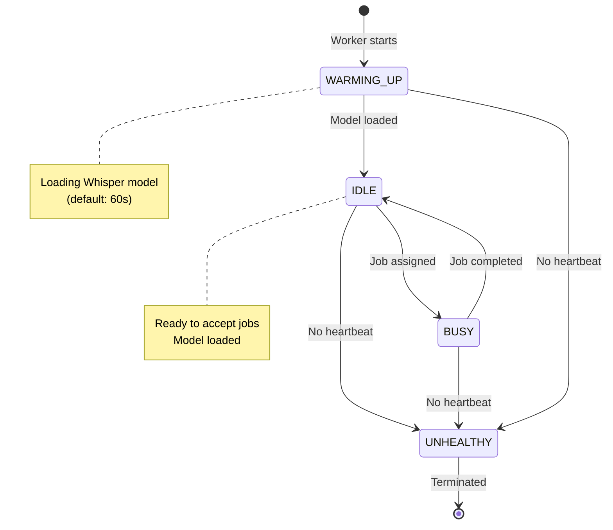

### Auto-scaling Logic

The system automatically scales workers based on queue depth:

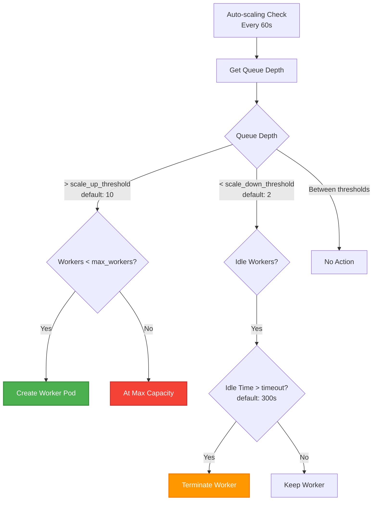

**Configuration** (defaults):

- **Scale Up Threshold**: `worker_scale_up_queue_depth` (default: 10 jobs)
- **Scale Down Threshold**: `worker_scale_down_queue_depth` (default: 2 jobs)
- **Idle Timeout**: `worker_idle_timeout_seconds` (default: 300s = 5 minutes)
- **Min Workers**: `min_workers` (default: 0)
- **Max Workers**: `max_workers` (default: 5)
- **Check Interval**: `worker_auto_scaling_interval_seconds` (default: 60s)

### RunPod Integration

Workers are managed via RunPod GraphQL API:

```python
# Create worker pod
mutation = """
mutation {
    podFindAndDeploy(
        input: {
            templateId: "{template_id}"
            cloudType: ALL
            gpuCount: 1
        }
    ) {
        id
        name
    }
}
"""

# Terminate worker pod
mutation = """
mutation {
    podTerminate(input: { podId: "{pod_id}" }) {
        id
    }
}
"""
```

**Requirements**:

- `RUNPOD_API_KEY`: RunPod API key
- `RUNPOD_TEMPLATE_ID`: Template ID for worker pods
- `RUNPOD_API_URL`: GraphQL API endpoint (default: `https://api.runpod.io/graphql`)

## Queue Management

Job queue management for distributed processing (Level 3).

### Service: `QueueService`

**Location**: `app/services/jobs/queue_service.py`

### Features

1. **Priority Queue**: Jobs processed by priority (HIGH > NORMAL > LOW)
2. **Job Visibility**: Jobs hidden from queue while processing (visibility timeout)
3. **Retry Logic**: Automatic retry for failed jobs (max retries: 3, default)
4. **Dead Letter Queue**: Failed jobs moved to DLQ after max retries
5. **Queue Statistics**: Real-time queue depth and processing stats

### Queue Backend

Currently supports **Redis Queue** (Redis Sorted Sets + Hashes):

- **Queue Name**: `queue:{queue_name}` (default: `queue:transcription_jobs`)
- **Processing Queue**: `queue:{queue_name}:processing` (tracks jobs being processed)
- **Dead Letter Queue**: `queue:{queue_name}:dlq` (failed jobs after max retries)

**Future**: SQS backend planned but not yet implemented.

### Priority System

Jobs are enqueued with priority scores:

```python
priority_score = {
    "low": 0,
    "normal": 1,
    "high": 2
}.get(priority.value, 1)

# Score = priority * 1,000,000 + timestamp
# Ensures higher priority jobs are processed first
# Within same priority, FIFO order
score = priority_score * 1000000 + time.time()
```

### Job Lifecycle in Queue

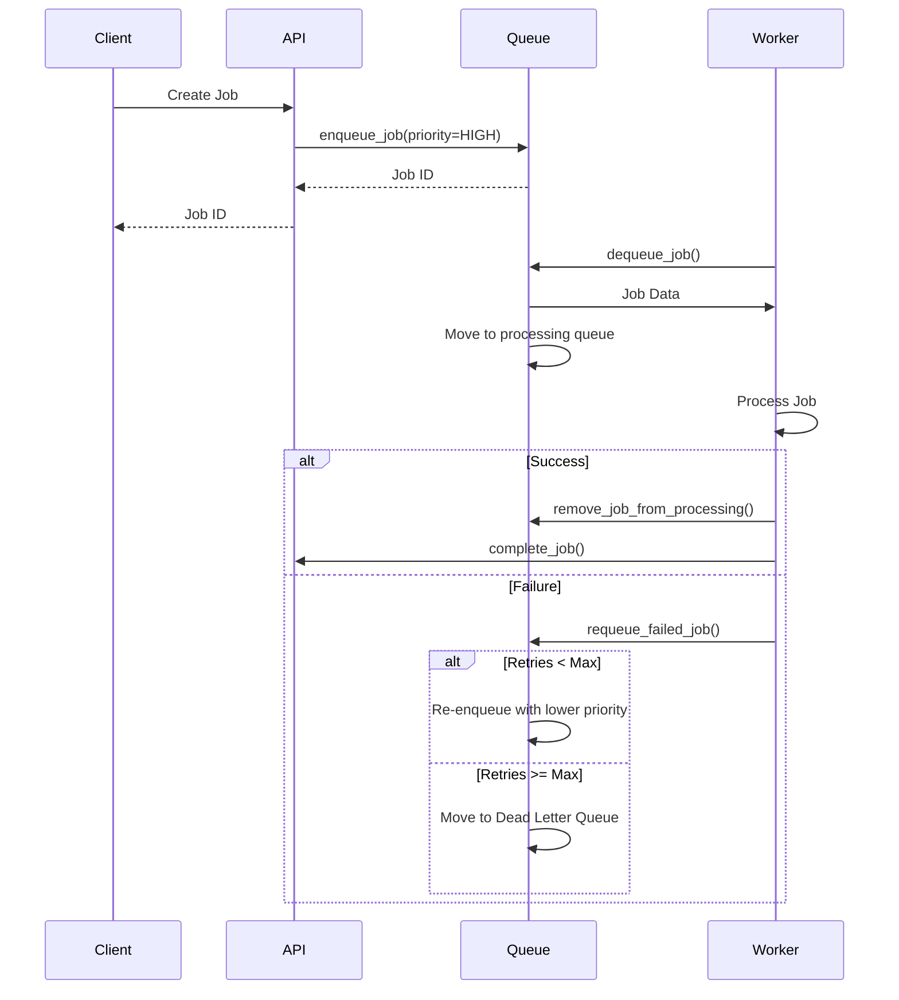

## Storage Systems

Multi-tier storage strategy for scalability and performance.

### Storage Architecture

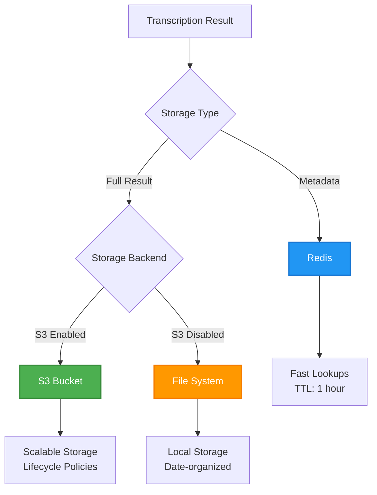

### Redis Storage

**Purpose**: Fast job metadata storage

**Data Stored**:

- Job status (`queued`, `processing`, `completed`, `failed`)
- Timestamps (`created_at`, `completed_at`)
- Video metadata (`video_id`, `video_url`)
- Processing metadata (`language`, `model`, `duration`, `source`)
- Error information (`error`, `error_code`, `error_details`)
- Result reference (`resultRef`: file path or S3 URI)
- Webhook URL (if provided)

**Key Format**: `job:{job_id}`

**TTL**: `job_ttl_seconds` (default: 3600s = 1 hour)

**Operations**:

- `SETEX` for storing with TTL
- `SCAN` for listing all jobs (non-blocking)
- Pipeline for batch operations

### File System Storage

**Purpose**: Full result storage (fallback when S3 disabled)

**Structure**:

```
{temp_store_dir}/
  YYYY-MM-DD/
    {job_id}.json
```

**Default Path**: `./results`

**Content**: Complete transcription result JSON with:

- Full transcript text
- All segments with timestamps
- Language, confidence, model info
- Video metadata
- Processing timestamps

**Organization**: Date-based directories for easy cleanup

### S3 Storage (Level 3)

**Purpose**: Scalable, persistent storage

**Structure**:

```
s3://{bucket}/
  media/
    YYYY-MM-DD/
      {job_id}.{ext}          # Audio files
  results/
    YYYY-MM-DD/
      {job_id}.json          # Transcription results
```

**Features**:

- **Multipart Uploads**: For files > 100MB (configurable)
- **Chunk Size**: 10MB per chunk (configurable)
- **Lifecycle Policies**: Automatic cleanup of old files
- **CDN Integration**: Can be used with CloudFront or similar

**Configuration**:

- `S3_ENABLED`: Enable S3 storage (default: `False`)
- `S3_BUCKET_NAME`: Bucket name (required if enabled)
- `S3_REGION`: AWS region (default: `us-east-1`)
- `S3_ENDPOINT_URL`: For S3-compatible storage (e.g., Cloudflare R2, MinIO)

## Caching Strategy

Multi-level caching to reduce API calls and improve performance.

### Cache Architecture

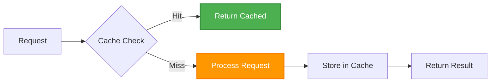

### Captions Cache

**Type**: `TTLCache` (in-memory LRU cache)

**Key Format**: `{video_id}:{translate_to}:{format}`

- Example: `"dQw4w9WgXcQ:en:json"`
- `translate_to` is `"none"` if not specified

**TTL**: `cache_ttl_seconds` (default: 300s = 5 minutes)

**Max Size**: `cache_max_size` (default: 1000 entries)

**Eviction**: LRU (Least Recently Used) when cache is full

**Purpose**: Avoid repeated YouTube Transcript API calls for same video

**Monitoring**: Logs warnings when cache reaches 80% capacity (configurable)

### Video ID Cache

**Type**: `TTLCache` (in-memory LRU cache)

**Key**: YouTube URL (full URL string)

**Value**: Extracted video ID

**TTL**: `video_id_cache_ttl_seconds` (default: 3600s = 1 hour)

**Max Size**: `video_id_cache_max_size` (default: 5000 entries)

**Purpose**: Avoid repeated regex operations for URL parsing

**Note**: Video IDs are immutable, so longer TTL is safe

### Job List Cache

**Type**: In-memory dictionary with timestamp

**TTL**: `job_list_cache_ttl` (default: 10 seconds)

**Purpose**: Reduce Redis load for frequent job list requests

**Invalidation**: Automatically invalidated when jobs are created/updated

**Note**: Short TTL ensures near-real-time accuracy while reducing Redis load

## Error Handling

Comprehensive error handling with consistent error format.

### Error Hierarchy

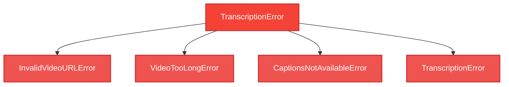

### Error Propagation

1. **Service Layer**: Raises domain-specific exceptions

   - `TranscriptionService`: Raises `TranscriptionError` subclasses
   - `YouTubeCaptionsService`: Raises `CouldNotRetrieveTranscript`, `TranscriptsDisabled`
   - `WhisperService`: Raises `TranscriptionError` with specific codes

2. **API Layer**: Catches exceptions, converts to HTTP responses

   - Maps exceptions to HTTP status codes
   - Formats error responses consistently

3. **Error Handlers**: Global error handlers for consistent format
   - Registered in `app/core/error_handlers.py`
   - Ensures all errors follow same structure

### Error Response Format

All errors follow this consistent format:

```json
{
  "code": "ERROR_CODE",
  "message": "Human-readable error message",
  "details": {
    "video_id": "dQw4w9WgXcQ",
    "duration": 7200,
    "max_duration_seconds": 3600,
    "additional": "context"
  }
}
```

**Common Error Codes**:

- `INVALID_VIDEO_URL`: Video URL is invalid or malformed
- `VIDEO_TOO_LONG`: Video exceeds maximum duration (1 hour)
- `CAPTIONS_NOT_AVAILABLE`: No captions available for video
- `TRANSLATION_NOT_SUPPORTED`: Translation requested but not supported (ASR only supports English)
- `TRANSCRIPTION_FAILED`: Whisper transcription failed
- `MODEL_NOT_LOADED`: Whisper model failed to load
- `JOB_NOT_FOUND`: Job ID not found
- `QUEUE_ERROR`: Queue operation failed

## Performance Optimizations

Various optimizations to improve performance and reduce latency.

### Model Pre-loading

Whisper model is pre-loaded at application startup to avoid first-request latency:

```python
# app/core/startup.py
def preload_whisper_model():
    """Pre-load Whisper model at startup."""
    whisper_service = WhisperService.get_instance()
    whisper_service.ensure_model_loaded()
```

**Benefits**:

- Eliminates first-request delay (model loading can take 10-30 seconds)
- Ensures model is ready before accepting requests
- Thread-safe loading prevents race conditions

### Connection Pooling

- **Redis**: Connection pool with configurable max connections (default: 50)
  - Reuses connections across requests
  - Reduces connection overhead
- **HTTP**: httpx with connection pooling for webhooks
  - Reuses TCP connections
  - Configurable timeouts and retries
- **S3**: boto3 with connection pooling
  - Multipart uploads for large files
  - Automatic retry with exponential backoff

### Async Processing

- **FastAPI Async Endpoints**: Non-blocking I/O for API requests
- **Background Tasks**: Async job processing doesn't block API responses
- **Thread Pools**: Whisper inference runs in thread pool to avoid blocking event loop
- **Async Redis Operations**: Where possible, uses async Redis operations

### Batch Operations

- **Redis Pipeline**: Multiple Redis operations batched together
  - Reduces round-trips
  - Atomic operations
- **S3 Multipart Uploads**: Large files uploaded in chunks
  - Configurable chunk size (default: 10MB)
  - Threshold for multipart (default: 100MB)

### Caching Optimizations

- **Multi-level Caching**: Captions, video IDs, and job lists cached
- **LRU Eviction**: Efficient memory usage
- **TTL-based Expiration**: Automatic cache invalidation
- **Cache Warming**: Pre-load frequently accessed data (future enhancement)

### Audio Processing Optimizations

- **Format Optimization**: Audio converted to WAV, 16kHz, mono (optimal for Whisper)
- **Streaming Downloads**: Large audio files downloaded in chunks
- **Automatic Cleanup**: Temporary audio files deleted after processing
- **S3 Upload**: Audio uploaded to S3 before processing (enables worker access)

## Configuration Reference

Key configuration settings referenced in this document:

### Processing Thresholds

- `async_threshold_seconds`: 300 (5 minutes) - Sync/async boundary
- `max_video_duration_seconds`: 3600 (1 hour) - Maximum video length

### Caching

- `cache_ttl_seconds`: 300 (5 minutes) - Captions cache TTL
- `cache_max_size`: 1000 - Captions cache max entries
- `video_id_cache_ttl_seconds`: 3600 (1 hour) - Video ID cache TTL
- `video_id_cache_max_size`: 5000 - Video ID cache max entries
- `job_list_cache_ttl`: 10 (seconds) - Job list cache TTL

### Storage

- `job_ttl_seconds`: 3600 (1 hour) - Job metadata TTL in Redis
- `temp_store_dir`: `./results` - Local result storage directory
- `s3_enabled`: `False` - Enable S3 storage

### Workers

- `min_workers`: 0 - Minimum GPU workers
- `max_workers`: 5 - Maximum GPU workers
- `worker_scale_up_queue_depth`: 10 - Queue depth to trigger scale-up
- `worker_scale_down_queue_depth`: 2 - Queue depth to trigger scale-down
- `worker_idle_timeout_seconds`: 300 (5 minutes) - Idle timeout before scale-down

### Queue

- `queue_max_retries`: 3 - Maximum retry attempts for failed jobs
- `queue_visibility_timeout_seconds`: 300 (5 minutes) - Job visibility timeout

## Next Steps

- Review [Architecture Documentation](architecture.md) for system design
- Check [API Reference](api-reference.md) for endpoint details
- See [Configuration Guide](CONFIGURATION.md) for all settings
