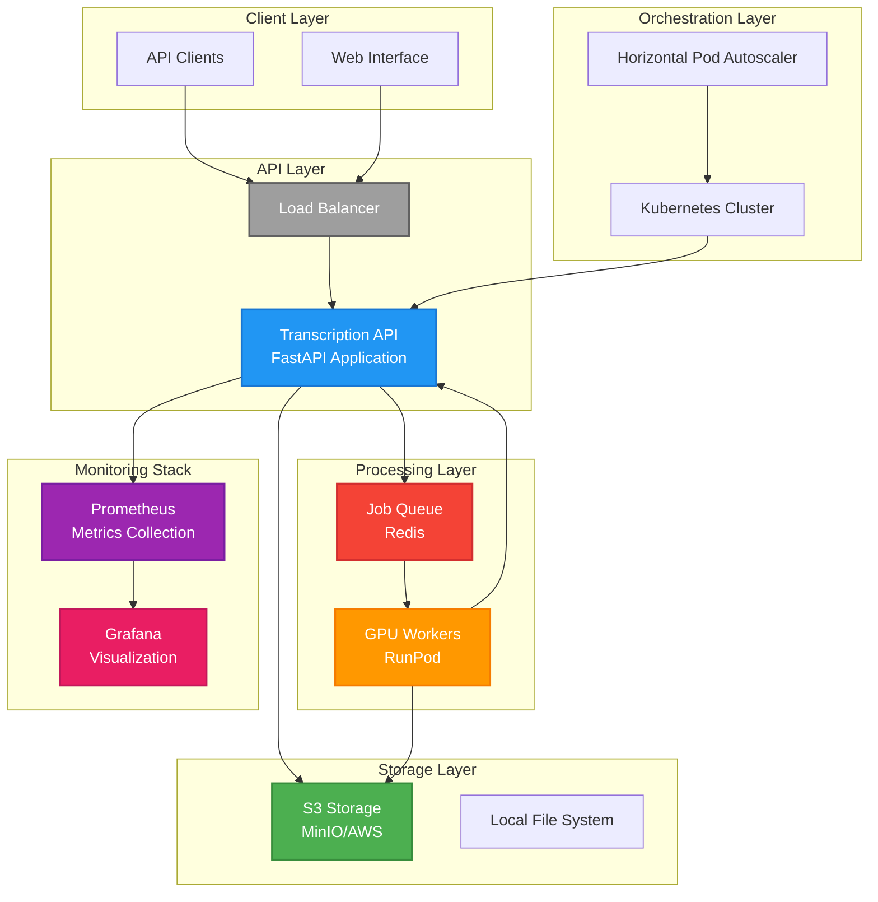
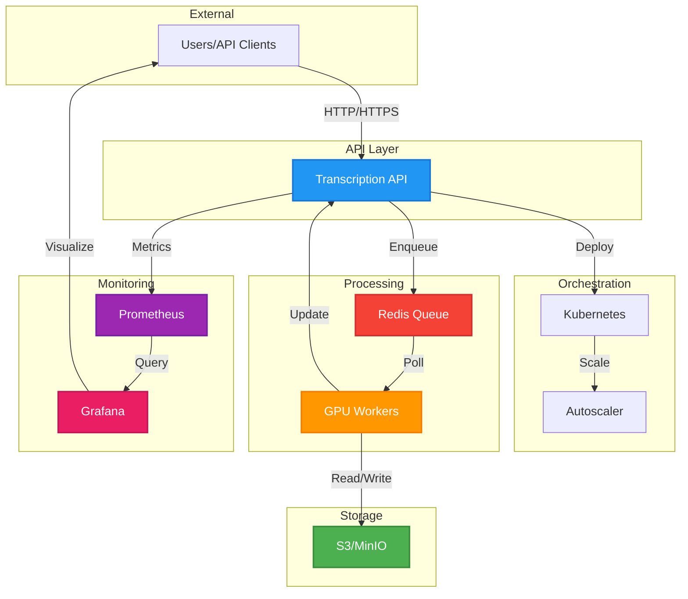
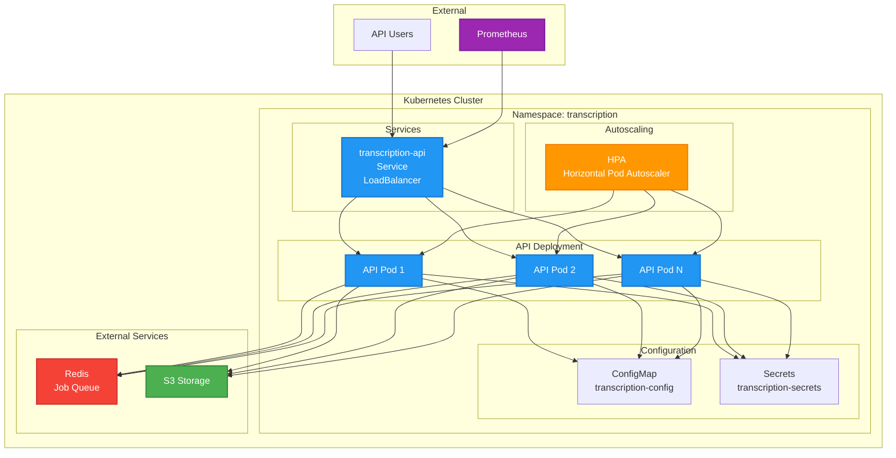
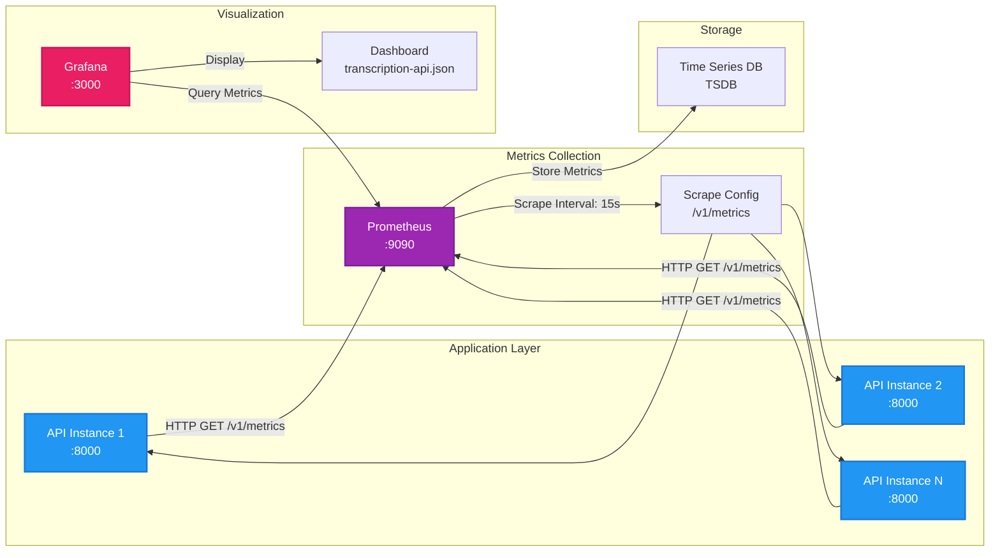
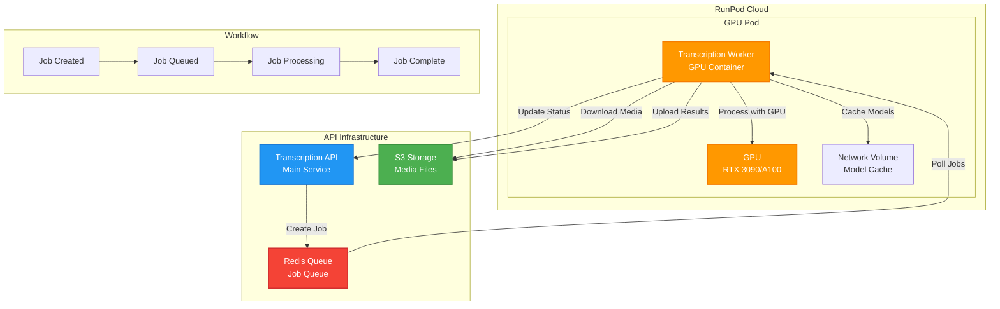
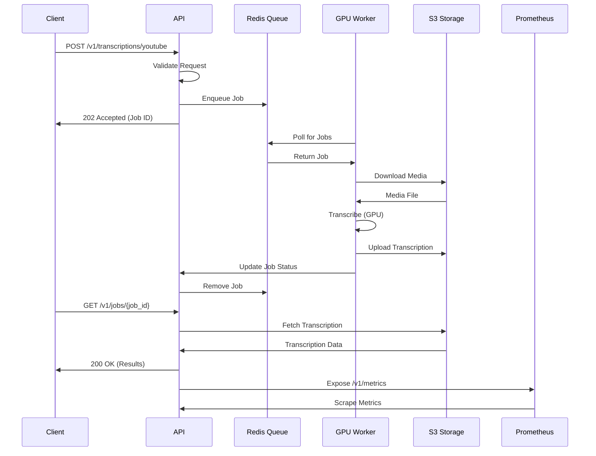
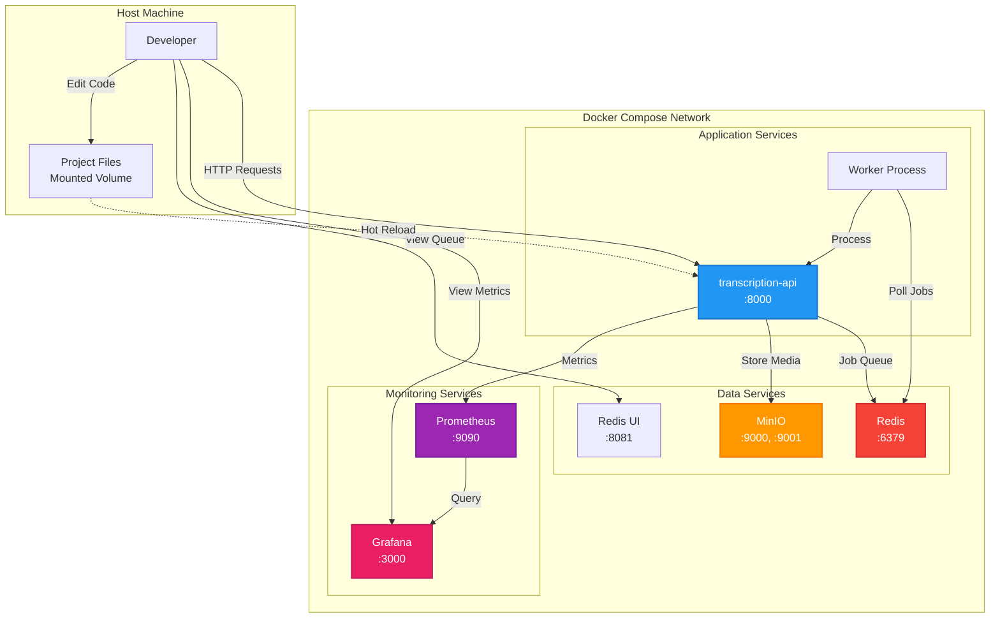

# Infrastructure Documentation

This document provides comprehensive documentation for the Transcription API infrastructure components, including deployment configurations, monitoring setup, and operational guides.

## Table of Contents

1. [Overview](#overview)
2. [Installation Instructions](#installation-instructions)
3. [Configuration Options](#configuration-options)
4. [API Reference](#api-reference)
5. [Usage Examples](#usage-examples)
6. [Troubleshooting Guide](#troubleshooting-guide)
7. [FAQ Section](#faq-section)

> **Note**: This document includes multiple architecture diagrams using Mermaid syntax. These diagrams visualize system components, data flows, and deployment architectures. Most modern Markdown viewers (GitHub, GitLab, VS Code, etc.) support Mermaid rendering.

---

## 1. Overview

The Transcription API infrastructure consists of several components working together to provide a scalable, monitored, and production-ready transcription service:

### System Architecture Diagram



### Architecture Components

#### **Kubernetes Deployment**

- **Purpose**: Container orchestration for the main API service
- **Components**:
  - API Deployment with configurable replicas
  - Horizontal Pod Autoscaler (HPA) for automatic scaling
  - Service with LoadBalancer type for external access
  - ConfigMap and Secrets for configuration management
- **Location**: `infrastructure/kubernetes/`

#### **Prometheus Monitoring**

- **Purpose**: Metrics collection and time-series database
- **Features**:
  - Scrapes metrics from the Transcription API at `/v1/metrics`
  - Supports multiple API variants (production, dev, GPU)
  - Configurable scrape intervals and retention
- **Location**: `infrastructure/prometheus/`

#### **Grafana Visualization**

- **Purpose**: Metrics visualization and dashboards
- **Features**:
  - Pre-configured Prometheus datasource
  - Transcription API dashboard with key metrics
  - Auto-provisioned dashboards and datasources
- **Location**: `infrastructure/grafana/`

#### **RunPod GPU Workers**

- **Purpose**: GPU-accelerated transcription workers for distributed processing
- **Components**:
  - Dockerfile for GPU worker container
  - Startup script for worker initialization
- **Location**: `infrastructure/runpod/`

#### **Terraform** (Placeholder)

- **Purpose**: Infrastructure as Code (IaC) for cloud resource provisioning
- **Status**: Directory exists but not yet configured
- **Location**: `infrastructure/terraform/`

### Component Interaction Diagram



### Target Audience

- **Developers**: Setting up local development environments
- **DevOps Engineers**: Deploying and managing production infrastructure
- **SRE/Platform Engineers**: Monitoring, scaling, and troubleshooting
- **System Administrators**: Configuring and maintaining infrastructure components

### Prerequisites

Before setting up the infrastructure, ensure you have:

- **Docker** and **Docker Compose** (for local development)
- **Kubernetes cluster** (for production deployment)
- **kubectl** configured (for Kubernetes deployments)
- **Prometheus** and **Grafana** (or use Docker Compose)
- **RunPod account** (for GPU workers)
- **S3-compatible storage** (AWS S3, MinIO, etc.)
- **Redis** instance (for job queue management)

---

## 2. Installation Instructions

### 2.1 Local Development Setup (Docker Compose)

The easiest way to get started is using Docker Compose, which sets up all infrastructure components locally.

#### Step 1: Environment Configuration

Create a `.env` file in the project root (copy from `env.example`):

```bash
cp env.example .env
```

Required environment variables:

```bash
# Redis Configuration
REDIS_PASSWORD=your-secure-redis-password
REDIS_UI_USER=admin
REDIS_UI_PASSWORD=admin-password

# MinIO Configuration (for local S3)
MINIO_ROOT_USER=minioadmin
MINIO_ROOT_PASSWORD=minioadmin

# Grafana Configuration
GRAFANA_ADMIN_USER=admin
GRAFANA_ADMIN_PASSWORD=admin

# API Configuration
API_KEYS=your-api-key-1,your-api-key-2
S3_ENABLED=true
S3_BUCKET_NAME=transcription-storage
S3_REGION=us-east-1
S3_ACCESS_KEY_ID=your-access-key
S3_SECRET_ACCESS_KEY=your-secret-key
```

#### Step 2: Start Infrastructure Services

For development with hot-reload:

```bash
docker-compose -f docker-compose.dev.yml up -d
```

For production-like setup:

```bash
docker-compose up -d
```

This will start:

- Redis (port 6379)
- Redis UI (port 8081)
- MinIO (ports 9000, 9001)
- Prometheus (port 9090)
- Grafana (port 3000)
- Transcription API (port 8000)

#### Step 3: Verify Services

Check service health:

```bash
# Check all services
docker-compose ps

# Check API health
curl http://localhost:8000/health

# Check Prometheus
curl http://localhost:9090/-/healthy

# Check Grafana
curl http://localhost:3000/api/health
```

### 2.2 Kubernetes Deployment

#### Kubernetes Architecture Diagram



#### Step 1: Prepare Kubernetes Cluster

Ensure your `kubectl` is configured and you have cluster access:

```bash
kubectl cluster-info
kubectl get nodes
```

#### Step 2: Create Namespace (Optional)

```bash
kubectl create namespace transcription
kubectl config set-context --current --namespace=transcription
```

#### Step 3: Configure Secrets

**Important**: Update the secrets in `api-deployment.yaml` before deploying:

```yaml
apiVersion: v1
kind: Secret
metadata:
  name: transcription-secrets
type: Opaque
stringData:
  api-keys: "your-api-keys-here"
  s3-access-key-id: "your-access-key"
  s3-secret-access-key: "your-secret-key"
  redis-password: "your-redis-password"
```

Or create secrets separately:

```bash
kubectl create secret generic transcription-secrets \
  --from-literal=api-keys='your-api-keys' \
  --from-literal=s3-access-key-id='your-key' \
  --from-literal=s3-secret-access-key='your-secret' \
  --from-literal=redis-password='your-password'
```

#### Step 4: Update ConfigMap

Edit `infrastructure/kubernetes/api-deployment.yaml` and update the ConfigMap:

```yaml
apiVersion: v1
kind: ConfigMap
metadata:
  name: transcription-config
data:
  redis-host: "redis-service.default.svc.cluster.local"
  redis-port: "6379"
  s3-bucket-name: "transcription-storage"
  s3-region: "us-east-1"
```

#### Step 5: Update Docker Image

Replace `your-registry/transcription-api:latest` with your actual image:

```bash
# Build and push your image
docker build -t your-registry/transcription-api:latest .
docker push your-registry/transcription-api:latest
```

#### Step 6: Deploy to Kubernetes

```bash
kubectl apply -f infrastructure/kubernetes/api-deployment.yaml
kubectl apply -f infrastructure/kubernetes/hpa.yaml
```

#### Step 7: Verify Deployment

```bash
# Check deployment status
kubectl get deployments
kubectl get pods
kubectl get services

# Check logs
kubectl logs -f deployment/transcription-api

# Check HPA
kubectl get hpa
```

### 2.3 Prometheus Setup

#### Monitoring Stack Architecture Diagram



#### Standalone Installation

If not using Docker Compose:

1. **Download Prometheus**:

   ```bash
   wget https://github.com/prometheus/prometheus/releases/download/v2.45.0/prometheus-2.45.0.linux-amd64.tar.gz
   tar xvfz prometheus-*.tar.gz
   cd prometheus-*
   ```

2. **Copy Configuration**:

   ```bash
   cp ../infrastructure/prometheus/prometheus.yml prometheus.yml
   ```

3. **Start Prometheus**:
   ```bash
   ./prometheus --config.file=prometheus.yml
   ```

#### Docker Installation

```bash
docker run -d \
  -p 9090:9090 \
  -v $(pwd)/infrastructure/prometheus/prometheus.yml:/etc/prometheus/prometheus.yml \
  -v prometheus-data:/prometheus \
  prom/prometheus:latest \
  --config.file=/etc/prometheus/prometheus.yml \
  --storage.tsdb.path=/prometheus \
  --storage.tsdb.retention.time=200h
```

### 2.4 Grafana Setup

#### Standalone Installation

1. **Install Grafana** (Ubuntu/Debian):

   ```bash
   sudo apt-get install -y software-properties-common
   sudo add-apt-repository "deb https://packages.grafana.com/oss/deb stable main"
   wget -q -O - https://packages.grafana.com/gpg.key | sudo apt-key add -
   sudo apt-get update
   sudo apt-get install grafana
   ```

2. **Copy Configuration**:

   ```bash
   sudo cp -r infrastructure/grafana/datasources /etc/grafana/provisioning/
   sudo cp -r infrastructure/grafana/dashboards /etc/grafana/provisioning/
   ```

3. **Start Grafana**:
   ```bash
   sudo systemctl start grafana-server
   sudo systemctl enable grafana-server
   ```

#### Docker Installation

```bash
docker run -d \
  -p 3000:3000 \
  -v $(pwd)/infrastructure/grafana/datasources:/etc/grafana/provisioning/datasources \
  -v $(pwd)/infrastructure/grafana/dashboards:/etc/grafana/provisioning/dashboards \
  -e GF_SECURITY_ADMIN_USER=admin \
  -e GF_SECURITY_ADMIN_PASSWORD=admin \
  grafana/grafana:latest
```

### 2.5 RunPod GPU Workers Setup

#### RunPod Worker Architecture Diagram



#### Step 1: Build Worker Image

```bash
cd infrastructure/runpod
docker build -f worker_dockerfile -t your-registry/transcription-worker:latest ..
docker push your-registry/transcription-worker:latest
```

#### Step 2: Configure RunPod Template

In RunPod dashboard, create a new template with:

- **Container Image**: `your-registry/transcription-worker:latest`
- **Container Disk**: 20GB (minimum)
- **Environment Variables**:
  ```
  API_BASE_URL=https://your-api-domain.com
  WORKER_ID=runpod-worker-1
  GPU_TYPE=RTX 3090
  ```
- **Startup Command**: `/app/infrastructure/runpod/worker_startup.sh`

#### Step 3: Deploy Pod

Create a pod from the template with appropriate GPU configuration (e.g., RTX 3090, A100).

---

## 3. Configuration Options

### 3.1 Kubernetes Configuration

#### API Deployment (`api-deployment.yaml`)

**Key Configuration Options**:

```yaml
spec:
  replicas: 2 # Initial number of replicas
  containers:
    - name: api
      image: your-registry/transcription-api:latest
      ports:
        - containerPort: 8000
      resources:
        requests:
          cpu: 500m # Minimum CPU (0.5 cores)
          memory: 512Mi # Minimum memory
        limits:
          cpu: 2000m # Maximum CPU (2 cores)
          memory: 2Gi # Maximum memory
      livenessProbe:
        httpGet:
          path: /health
          port: 8000
        initialDelaySeconds: 60 # Wait 60s before first check
        periodSeconds: 30 # Check every 30s
      readinessProbe:
        initialDelaySeconds: 30 # Wait 30s before first check
        periodSeconds: 10 # Check every 10s
```

**Environment Variables** (from ConfigMap and Secrets):

- `REDIS_HOST`: Redis service hostname
- `REDIS_PORT`: Redis port (default: 6379)
- `S3_BUCKET_NAME`: S3 bucket for media storage
- `S3_ENABLED`: Enable S3 storage (true/false)
- `S3_REGION`: AWS region for S3

#### Horizontal Pod Autoscaler (`hpa.yaml`)

**Scaling Configuration**:

```yaml
spec:
  minReplicas: 2 # Minimum pods
  maxReplicas: 10 # Maximum pods
  metrics:
    - type: Resource
      resource:
        name: cpu
        target:
          type: Utilization
          averageUtilization: 70 # Scale when CPU > 70%
    - type: Resource
      resource:
        name: memory
        target:
          type: Utilization
          averageUtilization: 80 # Scale when memory > 80%
  behavior:
    scaleDown:
      stabilizationWindowSeconds: 300 # Wait 5min before scaling down
      policies:
        - type: Percent
          value: 50 # Scale down max 50% at a time
    scaleUp:
      stabilizationWindowSeconds: 0 # Scale up immediately
      policies:
        - type: Percent
          value: 100 # Can double pods
        - type: Pods
          value: 2 # Or add 2 pods at once
```

**Best Practices**:

- Set `minReplicas` based on expected minimum load
- Set `maxReplicas` based on cluster capacity and cost constraints
- Use conservative `scaleDown` policies to avoid thrashing
- Monitor scaling behavior and adjust thresholds as needed

### 3.2 Prometheus Configuration

#### Main Configuration (`prometheus.yml`)

**Global Settings**:

```yaml
global:
  scrape_interval: 15s # How often to scrape metrics
  evaluation_interval: 15s # How often to evaluate rules
  external_labels:
    cluster: "transcription-local"
    environment: "development"
```

**Scrape Configuration**:

```yaml
scrape_configs:
  - job_name: "transcription-api"
    metrics_path: "/v1/metrics" # API metrics endpoint
    static_configs:
      - targets: ["transcription-api:8000"]
        labels:
          service: "transcription-api"
          environment: "local"
    scrape_interval: 10s # Override global interval
    scrape_timeout: 5s # Timeout for each scrape
```

**Configuration Options**:

- **scrape_interval**: How frequently to collect metrics (lower = more data, higher load)
- **scrape_timeout**: Maximum time to wait for a scrape (should be < scrape_interval)
- **retention**: How long to keep metrics (configured via command-line: `--storage.tsdb.retention.time=200h`)

**Adding New Targets**:

To monitor additional API instances:

```yaml
- job_name: "transcription-api-staging"
  metrics_path: "/v1/metrics"
  static_configs:
    - targets: ["staging-api.example.com:8000"]
      labels:
        service: "transcription-api"
        environment: "staging"
```

### 3.3 Grafana Configuration

#### Datasource Configuration (`datasources/prometheus.yml`)

```yaml
apiVersion: 1
datasources:
  - name: Prometheus
    type: prometheus
    access: proxy
    url: http://prometheus:9090 # Prometheus service URL
    isDefault: true
    jsonData:
      timeInterval: 15s # Query interval
```

**Configuration Options**:

- **url**: Prometheus server URL (use service name in Docker/K8s)
- **access**: `proxy` (recommended) or `direct`
- **isDefault**: Set as default datasource
- **timeInterval**: Default query interval for dashboards

#### Dashboard Provisioning (`dashboards/dashboard.yml`)

```yaml
apiVersion: 1
providers:
  - name: "Transcription API"
    orgId: 1
    folder: ""
    type: file
    disableDeletion: false
    updateIntervalSeconds: 10
    allowUiUpdates: true
    options:
      path: /etc/grafana/provisioning/dashboards
```

**Configuration Options**:

- **updateIntervalSeconds**: How often to check for dashboard updates
- **allowUiUpdates**: Allow manual dashboard edits (set to `false` in production)
- **path**: Directory containing dashboard JSON files

### 3.4 RunPod Worker Configuration

#### Dockerfile Configuration (`worker_dockerfile`)

**Base Image**:

```dockerfile
FROM nvidia/cuda:11.8.0-cudnn8-runtime-ubuntu22.04
```

**Key Environment Variables**:

```dockerfile
ENV PYTHONPATH=/app
ENV WORKER_ID=""
ENV RUNPOD_POD_ID=""
ENV API_BASE_URL=""
ENV GPU_TYPE=""
```

#### Startup Script Configuration (`worker_startup.sh`)

**Required Environment Variables**:

- `API_BASE_URL`: **REQUIRED** - Base URL of the Transcription API
- `WORKER_ID`: Optional - Auto-generated if not set
- `RUNPOD_POD_ID`: Optional - RunPod pod identifier
- `GPU_TYPE`: Optional - Auto-detected from `nvidia-smi` if not set

**Configuration in RunPod**:

When creating a RunPod template, set these environment variables:

```
API_BASE_URL=https://api.yourdomain.com
WORKER_ID=runpod-worker-1
GPU_TYPE=RTX 3090
```

---

## 4. API Reference

### 4.1 Data Flow Diagram



### 4.2 Metrics Endpoint

The Transcription API exposes Prometheus metrics at the `/v1/metrics` endpoint.

#### Endpoint Details

- **URL**: `GET /v1/metrics`
- **Authentication**: Not required (intended for monitoring systems)
- **Content-Type**: `text/plain; version=0.0.4; charset=utf-8`
- **Response Format**: Prometheus text format

#### Available Metrics

The API exposes the following metric types:

**Request Metrics**:

- `api_requests_total`: Total number of API requests (counter)
  - Labels: `method`, `endpoint`, `status`
- `api_request_duration_seconds`: Request duration histogram
  - Labels: `method`, `endpoint`

**Job Metrics**:

- `jobs_total`: Total number of jobs (counter)
  - Labels: `status`, `source`
- `job_duration_seconds`: Job processing duration histogram
  - Labels: `source`

**Queue Metrics**:

- `queue_depth`: Current queue depth (gauge)
  - Labels: `instance`

**Worker Metrics**:

- `workers_total`: Total number of workers (gauge)
  - Labels: `status`

#### Example Response

```prometheus
# HELP api_requests_total Total number of API requests
# TYPE api_requests_total counter
api_requests_total{endpoint="/v1/transcriptions/youtube",method="POST",status="200"} 42.0

# HELP api_request_duration_seconds Request duration in seconds
# TYPE api_request_duration_seconds histogram
api_request_duration_seconds_bucket{endpoint="/v1/transcriptions/youtube",method="POST",le="0.005"} 10.0
api_request_duration_seconds_bucket{endpoint="/v1/transcriptions/youtube",method="POST",le="0.01"} 25.0
api_request_duration_seconds_bucket{endpoint="/v1/transcriptions/youtube",method="POST",le="0.025"} 40.0
api_request_duration_seconds_bucket{endpoint="/v1/transcriptions/youtube",method="POST",le="+Inf"} 42.0
api_request_duration_seconds_sum{endpoint="/v1/transcriptions/youtube",method="POST"} 0.523
api_request_duration_seconds_count{endpoint="/v1/transcriptions/youtube",method="POST"} 42.0

# HELP queue_depth Current queue depth
# TYPE queue_depth gauge
queue_depth{instance="transcription-api-7d8f9c4b-2x5k8"} 5.0

# HELP workers_total Total number of workers
# TYPE workers_total gauge
workers_total{status="active"} 3.0
workers_total{status="idle"} 1.0
```

#### Querying Metrics

**Using curl**:

```bash
curl http://localhost:8000/v1/metrics
```

**Using Prometheus Query Language (PromQL)**:

Request rate by endpoint:

```promql
sum(rate(api_requests_total[5m])) by (endpoint)
```

95th percentile request duration:

```promql
histogram_quantile(0.95, sum(rate(api_request_duration_seconds_bucket[5m])) by (le, endpoint))
```

Current queue depth:

```promql
sum(queue_depth)
```

Active workers:

```promql
sum(workers_total{status="active"})
```

#### Configuration

Metrics can be enabled/disabled via application configuration:

- `METRICS_ENABLED`: Enable/disable metrics collection (default: `true`)
- `OBSERVABILITY_ENABLED`: Enable observability service (default: `true`)

If metrics are disabled, the endpoint returns:

```
# Metrics are disabled
```

---

## 5. Usage Examples

### 5.1 Local Development Workflow

#### Docker Compose Architecture Diagram



#### Starting the Full Stack

```bash
# Start all services
docker-compose -f docker-compose.dev.yml up -d

# View logs
docker-compose -f docker-compose.dev.yml logs -f transcription-api

# Stop all services
docker-compose -f docker-compose.dev.yml down
```

#### Accessing Services

- **API**: http://localhost:8000
- **API Docs**: http://localhost:8000/docs
- **Prometheus**: http://localhost:9090
- **Grafana**: http://localhost:3000 (admin/admin)
- **Redis UI**: http://localhost:8081
- **MinIO Console**: http://localhost:9001

#### Testing Metrics Collection

```bash
# Generate some API requests
curl -X POST http://localhost:8000/v1/transcriptions/youtube \
  -H "X-API-Key: your-api-key" \
  -F "url=https://www.youtube.com/watch?v=example"

# Check metrics endpoint
curl http://localhost:8000/v1/metrics | grep api_requests_total

# Query in Prometheus
# Open http://localhost:9090 and run:
# sum(rate(api_requests_total[5m]))
```

### 5.2 Kubernetes Deployment Workflow

#### Deploying Updates

```bash
# Build new image
docker build -t your-registry/transcription-api:v1.2.0 .
docker push your-registry/transcription-api:v1.2.0

# Update deployment
kubectl set image deployment/transcription-api \
  api=your-registry/transcription-api:v1.2.0

# Watch rollout
kubectl rollout status deployment/transcription-api

# Rollback if needed
kubectl rollout undo deployment/transcription-api
```

#### Scaling Manually

```bash
# Scale to 5 replicas
kubectl scale deployment/transcription-api --replicas=5

# Check HPA status
kubectl get hpa transcription-api-hpa
kubectl describe hpa transcription-api-hpa
```

#### Viewing Logs

```bash
# All pods
kubectl logs -f -l app=transcription-api

# Specific pod
kubectl logs -f transcription-api-7d8f9c4b-2x5k8

# Previous container (if crashed)
kubectl logs -f transcription-api-7d8f9c4b-2x5k8 --previous
```

### 5.3 Monitoring Setup

#### Setting Up Grafana Dashboard

1. **Access Grafana**: http://localhost:3000
2. **Login**: Use credentials from `.env` (default: admin/admin)
3. **Verify Datasource**:
   - Go to Configuration → Data Sources
   - Ensure Prometheus is configured and tested
4. **Import Dashboard**:
   - The dashboard is auto-provisioned from `infrastructure/grafana/dashboards/transcription-api.json`
   - Access via Dashboards → Transcription API Metrics

#### Creating Custom Queries

**Example: Error Rate**:

```promql
sum(rate(api_requests_total{status=~"5.."}[5m])) / sum(rate(api_requests_total[5m]))
```

**Example: Average Job Duration**:

```promql
rate(job_duration_seconds_sum[5m]) / rate(job_duration_seconds_count[5m])
```

**Example: Worker Utilization**:

```promql
sum(workers_total{status="active"}) / sum(workers_total) * 100
```

### 5.4 RunPod Worker Deployment

#### Creating a RunPod Template

1. **Login to RunPod**: https://www.runpod.io
2. **Navigate to Templates**: Create New Template
3. **Configure**:
   - **Name**: `transcription-worker`
   - **Container Image**: `your-registry/transcription-worker:latest`
   - **Container Disk**: 20GB
   - **Environment Variables**:
     ```
     API_BASE_URL=https://api.yourdomain.com
     ```
   - **Startup Command**: Leave empty (uses CMD from Dockerfile)
4. **Save Template**

#### Deploying a Pod

1. **Select Template**: Choose `transcription-worker`
2. **Select GPU**: Choose appropriate GPU (e.g., RTX 3090, A100)
3. **Configure**:
   - **Pod Name**: `transcription-worker-1`
   - **Network Volume**: Optional (for model caching)
4. **Deploy**: Click "Deploy"

#### Verifying Worker Connection

```bash
# Check worker registration via API
curl http://localhost:8000/v1/workers \
  -H "X-API-Key: your-api-key"

# Check metrics
curl http://localhost:8000/v1/metrics | grep workers_total
```

---

## 6. Troubleshooting Guide

### 6.1 Common Issues

#### Issue: Prometheus Cannot Scrape Metrics

**Symptoms**:

- No metrics in Prometheus UI
- `up{job="transcription-api"}` shows 0

**Diagnosis**:

```bash
# Check if API is accessible
curl http://transcription-api:8000/health

# Check metrics endpoint
curl http://transcription-api:8000/v1/metrics

# Check Prometheus targets
# Open http://localhost:9090/targets
```

**Solutions**:

1. **Network Connectivity**:

   - Ensure Prometheus and API are on the same Docker network
   - Check service names resolve correctly
   - Verify firewall rules

2. **Metrics Disabled**:

   - Check `METRICS_ENABLED` environment variable
   - Verify `OBSERVABILITY_ENABLED` is set

3. **Wrong Target Address**:
   - Update `prometheus.yml` with correct service name
   - For Docker Compose: use service name (e.g., `transcription-api`)
   - For Kubernetes: use service DNS (e.g., `transcription-api.default.svc.cluster.local`)

#### Issue: Grafana Shows "No Data"

**Symptoms**:

- Dashboard panels show "No data"
- Datasource test fails

**Diagnosis**:

```bash
# Test Prometheus connection from Grafana container
docker exec transcription-grafana curl http://prometheus:9090/api/v1/query?query=up

# Check datasource configuration
# In Grafana: Configuration → Data Sources → Prometheus → Test
```

**Solutions**:

1. **Datasource URL**:

   - Ensure URL is correct (use service name in Docker: `http://prometheus:9090`)
   - For external Prometheus, use full URL

2. **Network Access**:

   - Verify Grafana and Prometheus are on the same network
   - Check network configuration in `docker-compose.yml`

3. **Prometheus Not Running**:
   ```bash
   docker-compose ps prometheus
   docker-compose logs prometheus
   ```

#### Issue: Kubernetes Pods Not Starting

**Symptoms**:

- Pods in `CrashLoopBackOff` or `Pending` state
- `kubectl get pods` shows errors

**Diagnosis**:

```bash
# Check pod status
kubectl get pods
kubectl describe pod <pod-name>

# Check logs
kubectl logs <pod-name>
kubectl logs <pod-name> --previous
```

**Solutions**:

1. **Image Pull Errors**:

   - Verify image exists and is accessible
   - Check image pull secrets if using private registry

   ```bash
   kubectl create secret docker-registry regcred \
     --docker-server=<registry> \
     --docker-username=<user> \
     --docker-password=<pass>
   ```

2. **Resource Constraints**:

   - Check node resources: `kubectl describe nodes`
   - Reduce resource requests if cluster is full
   - Verify resource limits are reasonable

3. **Configuration Errors**:

   - Check ConfigMap exists: `kubectl get configmap transcription-config`
   - Check Secrets exist: `kubectl get secret transcription-secrets`
   - Verify environment variables are set correctly

4. **Health Check Failures**:
   - Increase `initialDelaySeconds` if app takes time to start
   - Verify `/health` endpoint responds correctly
   - Check application logs for startup errors

#### Issue: HPA Not Scaling

**Symptoms**:

- HPA shows `unknown` or doesn't scale pods
- High CPU/memory but no scaling

**Diagnosis**:

```bash
# Check HPA status
kubectl get hpa transcription-api-hpa
kubectl describe hpa transcription-api-hpa

# Check metrics server
kubectl top nodes
kubectl top pods
```

**Solutions**:

1. **Metrics Server Not Installed**:

   ```bash
   # Install metrics server (if not present)
   kubectl apply -f https://github.com/kubernetes-sigs/metrics-server/releases/latest/download/components.yaml
   ```

2. **Resource Requests Too High**:

   - HPA uses requests, not actual usage
   - Ensure requests are set correctly in deployment
   - Verify `kubectl top pods` shows metrics

3. **Scaling Limits**:
   - Check `minReplicas` and `maxReplicas` in HPA
   - Verify cluster has capacity for more pods

#### Issue: RunPod Worker Not Connecting

**Symptoms**:

- Worker doesn't appear in `/v1/workers` endpoint
- Jobs not being processed

**Diagnosis**:

```bash
# Check worker logs in RunPod dashboard
# Or via API if logs are accessible

# Verify API is accessible from worker
# In RunPod pod terminal:
curl $API_BASE_URL/health
```

**Solutions**:

1. **API_BASE_URL Not Set**:

   - Verify environment variable in RunPod template
   - Ensure URL is accessible from RunPod network
   - Check for HTTPS/HTTP mismatch

2. **Network Issues**:

   - Verify API endpoint is publicly accessible
   - Check firewall rules
   - Test connectivity from RunPod pod

3. **Authentication**:
   - Verify API keys are configured correctly
   - Check worker registration endpoint permissions

### 6.2 Performance Issues

#### High Memory Usage

**Symptoms**:

- Pods being OOMKilled
- High memory metrics

**Solutions**:

1. **Increase Memory Limits**:

   ```yaml
   resources:
     limits:
       memory: 4Gi # Increase from 2Gi
   ```

2. **Optimize Application**:

   - Review memory usage in application code
   - Check for memory leaks
   - Reduce batch sizes if applicable

3. **Scale Horizontally**:
   - Add more replicas to distribute load
   - Reduce memory per pod

#### High CPU Usage

**Symptoms**:

- High CPU metrics
- Slow response times

**Solutions**:

1. **Increase CPU Limits**:

   ```yaml
   resources:
     limits:
       cpu: 4000m # Increase from 2000m
   ```

2. **Optimize Code**:

   - Profile application for bottlenecks
   - Use async operations where possible
   - Cache frequently accessed data

3. **Scale Up**:
   - Increase HPA max replicas
   - Add more worker nodes to cluster

### 6.3 Debugging Commands

#### Docker Compose

```bash
# View all logs
docker-compose logs

# View specific service logs
docker-compose logs transcription-api

# Execute command in container
docker-compose exec transcription-api bash

# Check service health
docker-compose ps

# Restart specific service
docker-compose restart transcription-api
```

#### Kubernetes

```bash
# Get all resources
kubectl get all

# Describe resource
kubectl describe deployment transcription-api

# View events
kubectl get events --sort-by='.lastTimestamp'

# Port forward for local access
kubectl port-forward service/transcription-api 8000:80

# Execute command in pod
kubectl exec -it <pod-name> -- bash

# View resource usage
kubectl top pods
kubectl top nodes
```

#### Prometheus

```bash
# Query metrics via API
curl 'http://localhost:9090/api/v1/query?query=up'

# Check targets
curl 'http://localhost:9090/api/v1/targets'

# Reload configuration
curl -X POST http://localhost:9090/-/reload
```

---

## 7. FAQ Section

### 7.1 General Questions

#### Q: What is the difference between the dev and production docker-compose files?

**A**:

- **`docker-compose.dev.yml`**:
  - Hot-reload enabled for code changes
  - Code mounted as volume for live editing
  - Ports exposed for debugging
  - Less strict resource limits
- **`docker-compose.yml`**:
  - Production-like configuration
  - Code baked into image
  - More secure port bindings
  - Stricter resource limits
  - Better for testing production behavior

#### Q: Do I need to run all infrastructure components?

**A**: No, components are modular:

- **Required**: API, Redis (for job queue)
- **Recommended**: Prometheus, Grafana (for monitoring)
- **Optional**: MinIO (if using S3-compatible storage locally), RunPod workers (for GPU processing)

#### Q: Can I use AWS S3 instead of MinIO?

**A**: Yes! Set these environment variables:

```bash
S3_ENABLED=true
S3_BUCKET_NAME=your-bucket-name
S3_REGION=us-east-1
S3_ACCESS_KEY_ID=your-access-key
S3_SECRET_ACCESS_KEY=your-secret-key
# For AWS S3, don't set S3_ENDPOINT_URL
```

### 7.2 Kubernetes Questions

#### Q: How do I update the API without downtime?

**A**: Use rolling updates (default Kubernetes behavior):

```bash
# Update image
kubectl set image deployment/transcription-api api=your-registry/transcription-api:v1.2.0

# Kubernetes will:
# 1. Create new pods with new image
# 2. Wait for new pods to be ready
# 3. Terminate old pods
# 4. Maintain minimum replicas throughout
```

#### Q: How do I rollback a deployment?

**A**:

```bash
# View rollout history
kubectl rollout history deployment/transcription-api

# Rollback to previous version
kubectl rollout undo deployment/transcription-api

# Rollback to specific revision
kubectl rollout undo deployment/transcription-api --to-revision=2
```

#### Q: What happens if a pod crashes?

**A**: Kubernetes automatically:

1. Detects the crash (via health checks)
2. Terminates the unhealthy pod
3. Creates a new pod to replace it
4. Maintains desired replica count

Check why it crashed:

```bash
kubectl describe pod <pod-name>
kubectl logs <pod-name> --previous
```

### 7.3 Monitoring Questions

#### Q: How long are metrics retained?

**A**: Default retention in Docker Compose is 200 hours (~8 days). Configure via:

```yaml
command:
  - "--storage.tsdb.retention.time=200h"
```

For longer retention, increase this value or use external storage.

#### Q: Can I add custom metrics?

**A**: Yes! The API uses Prometheus client library. Add custom metrics in your application code:

```python
from prometheus_client import Counter, Histogram

custom_counter = Counter('my_custom_metric_total', 'Description')
custom_histogram = Histogram('my_custom_duration_seconds', 'Description')
```

They will automatically appear at `/v1/metrics`.

#### Q: How do I set up alerts?

**A**: Configure Alertmanager in Prometheus:

1. **Create alert rules** (`alerts.yml`):

   ```yaml
   groups:
     - name: transcription_alerts
       rules:
         - alert: HighErrorRate
           expr: rate(api_requests_total{status=~"5.."}[5m]) > 0.1
           for: 5m
           annotations:
             summary: "High error rate detected"
   ```

2. **Update `prometheus.yml`**:

   ```yaml
   rule_files:
     - "alerts.yml"

   alerting:
     alertmanagers:
       - static_configs:
           - targets: ["alertmanager:9093"]
   ```

3. **Deploy Alertmanager** (separate service)

### 7.4 RunPod Questions

#### Q: How many workers should I deploy?

**A**: Depends on:

- **Queue depth**: Monitor `queue_depth` metric
- **Job volume**: Average jobs per hour
- **Cost**: RunPod charges per GPU hour
- **Latency requirements**: More workers = lower latency

Start with 1-2 workers and scale based on metrics.

#### Q: Can workers run on different GPU types?

**A**: Yes! Workers auto-detect GPU type. You can deploy:

- Different GPU types in separate pods
- Mix of GPU types for cost optimization
- Workers will report their GPU type to the API

#### Q: How do I update worker code?

**A**:

1. Build new image: `docker build -f infrastructure/runpod/worker_dockerfile -t your-registry/transcription-worker:v1.2.0 .`
2. Push to registry: `docker push your-registry/transcription-worker:v1.2.0`
3. Update RunPod template with new image tag
4. Redeploy pods (or let them auto-update if configured)

### 7.5 Best Practices

#### Q: What are security best practices?

**A**:

1. **Secrets Management**:

   - Never commit secrets to git
   - Use Kubernetes Secrets or secret management tools
   - Rotate secrets regularly

2. **Network Security**:

   - Use private networks where possible
   - Restrict port exposure
   - Use TLS/HTTPS for external endpoints

3. **Access Control**:

   - Use API keys for authentication
   - Implement rate limiting
   - Monitor for suspicious activity

4. **Container Security**:
   - Use minimal base images
   - Keep images updated
   - Scan images for vulnerabilities

#### Q: How do I optimize costs?

**A**:

1. **Right-size Resources**:

   - Set appropriate CPU/memory requests and limits
   - Monitor actual usage and adjust
   - Use HPA to scale down during low traffic

2. **GPU Workers**:

   - Use spot/preemptible instances when available
   - Scale workers based on queue depth
   - Use appropriate GPU types for workload

3. **Storage**:

   - Set S3 lifecycle policies for old files
   - Use appropriate storage classes
   - Clean up temporary files regularly

4. **Monitoring**:
   - Set retention policies for Prometheus
   - Use sampling for high-cardinality metrics
   - Archive old metrics to cheaper storage

#### Q: How do I ensure high availability?

**A**:

1. **Multiple Replicas**:

   - Run at least 2 API replicas
   - Distribute across availability zones (if possible)

2. **Health Checks**:

   - Configure proper liveness and readiness probes
   - Set appropriate timeouts and thresholds

3. **Database/Queue**:

   - Use managed Redis with replication
   - Configure backups and failover

4. **Monitoring**:
   - Set up alerts for critical metrics
   - Monitor error rates and latency
   - Have runbooks for common issues

---

## Additional Resources

- **Prometheus Documentation**: https://prometheus.io/docs/
- **Grafana Documentation**: https://grafana.com/docs/
- **Kubernetes Documentation**: https://kubernetes.io/docs/
- **RunPod Documentation**: https://docs.runpod.io/
- **Docker Compose Documentation**: https://docs.docker.com/compose/

---

## Support

For issues, questions, or contributions:

- Check the troubleshooting guide above
- Review application logs
- Consult the main project documentation
- Open an issue in the project repository
